<style type="text/css">

body, td {
   font-size: 16px;
}
code.r{
  font-size: 12px;
}
pre {
  font-size: 12px
}

</style>

```{r klippy, echo=FALSE, include=TRUE}
klippy::klippy(lang = c("r", "markdown", "bash"), position = c("top", "right"))
getwd()
```

```{r, 'chunk_options', include=FALSE}
source("../bin/chunk-options.R")
knitr_fig_path("02-")
```

```{r, include = FALSE}
source("../bin/set_values.R")
```

# Objectives

- 1
- 2
- 3

...

# WebGestalt Overview

We've discussed some of the motivations for performing functional enrichment analysis, but what tools can we use to perform these kinds of analyses?

One option is [WebGestalt](http://www.webgestalt.org/) (WEB-based GEne SeT AnaLysis Toolkit) which has a web-based interface for running functional enrichment analysis. It supports a wide range of organisms and offers several methods for enrichment analysis.

## Overrepresentation results for bulk RNA-seq data using WebGestalt

<!-- per group discussions - plan to move this section to the start to give an overview of the results before using the tool -->

Let's look through an example of ORA (Over Representation Analysis) report from WebGestalt, similar to what might be shared by a collaborator. These results were generated for our bulk RNA-seq data, which compared gene expression between <!-- what was in the input tissue??--> wild-type mice fed a iron deficient vs control diet. 

<!-- TO ADD - figure of experimental design from RSD --> 

We'll go through the steps for how to run ORA using the browser version together shortly but let's first look through what WebGestalt reports and what results we can expect.

<br>

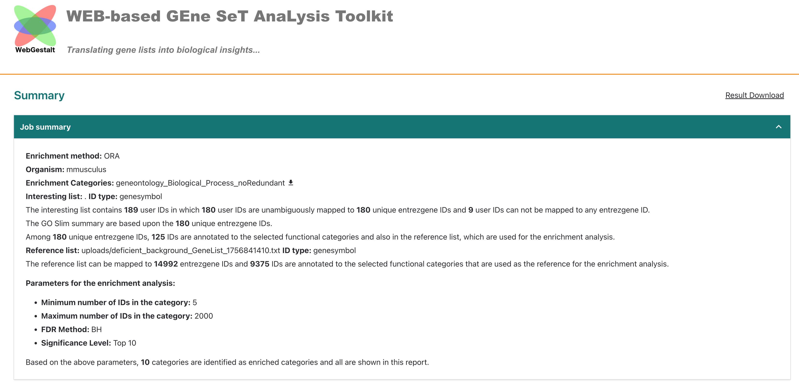  
At the top of the report, WebGestalt summarizes what was submitted. The bulk RNA-seq had 189 DE genes in total but only 180 genes mapped to gene symbols of the tool's reference (`entrezgene`) and then only 125 genes were annotated to the functional categories selected for this analysis, which was `geneontology_Biological_Process_noRedundant`. 

We can also see that the reference list was user provided (`upload/deficient_background_GeneList_XXXXXX.txt`) and that 14992 and 9375 were mapped to entrezgene gene symbols and functional catagories, respectively.

<br>

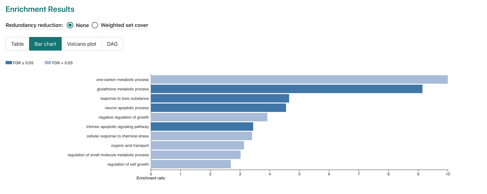  
Next, we can see the top 10 enriched GO-terms for our submitted DE genes from the non-redundant Biological Process GO-term set. While 10 terms are reported, only 4 are significant after FDR multiple hypothesis correction. <!-- add more detail here?? -->

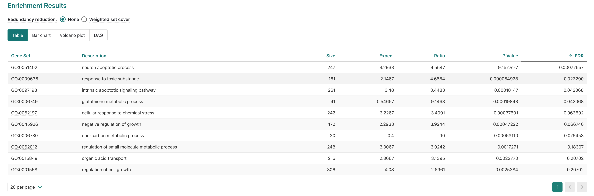  

Next, we can see the top 10 enriched GO-terms for our submitted DE genes from the non-redundant Biological Process GO-term set. While 10 terms are reported, only 4 are significant after FDR multiple hypothesis correction.

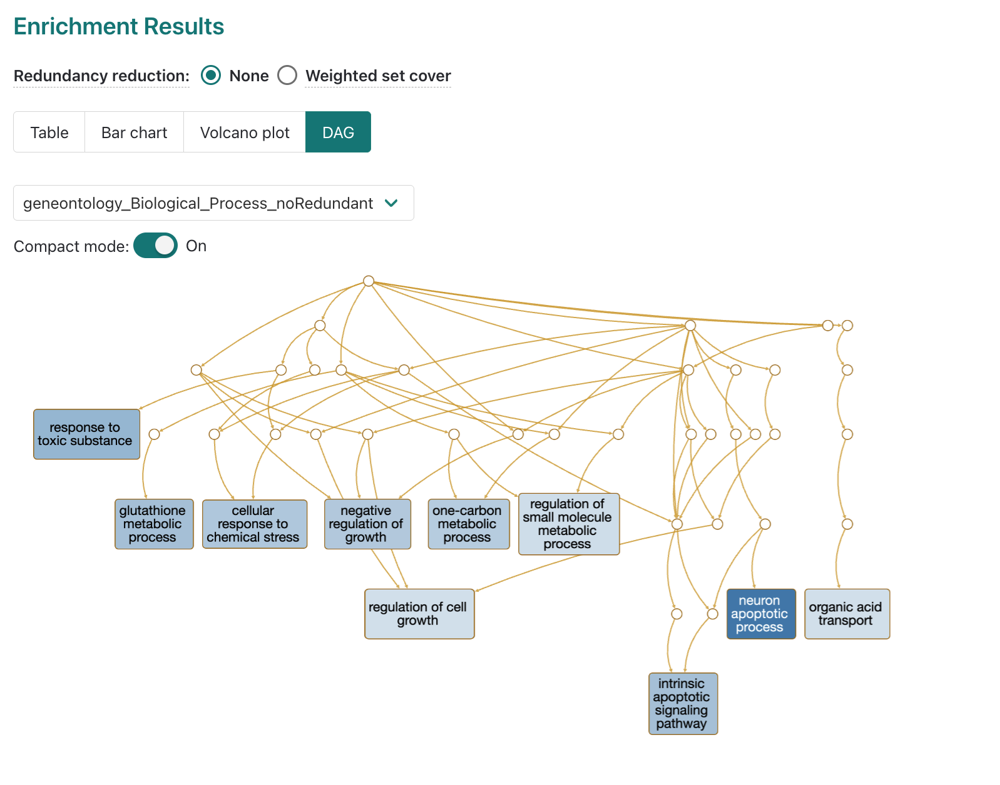  

If we look at the DAG map of GO terms included in the report, we can see that some of the significant terms are related, like `intrinsic apoptotic signaling pathway` and `neuron apoptotic process`. This can be useful for interpreting why a GO term that's unlikely to be applicable to the experiment (e.g. neuronal process from non-brain tissue) might be coming up as enriched. 

<!-- change to dropdown? -->
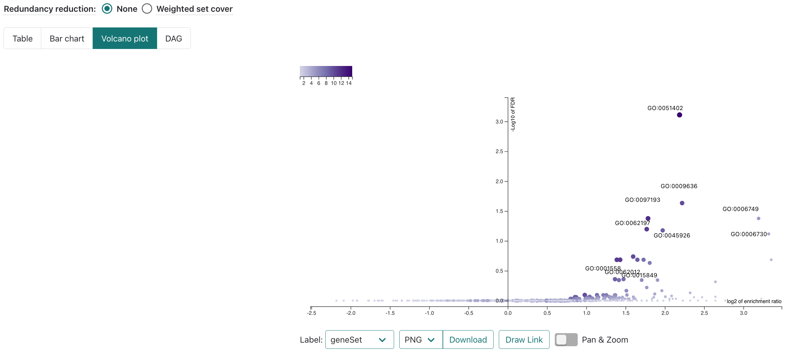  

### Individual GO-term examples

Next let's look at some of the significantly enriched terms.

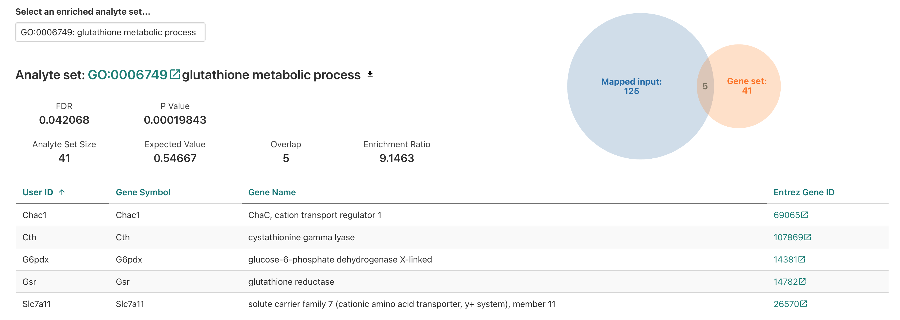 

Starting with glutathione metabolic process we see ... <!-- add more context -->

Based on the experimental design, is finding a enrichment for a metabolic process surprising? Is it surprising to find that this specific process is enriched? <!--- add call out box or quote to highlight question ---> 

Let's look at some of our other enriched results. 

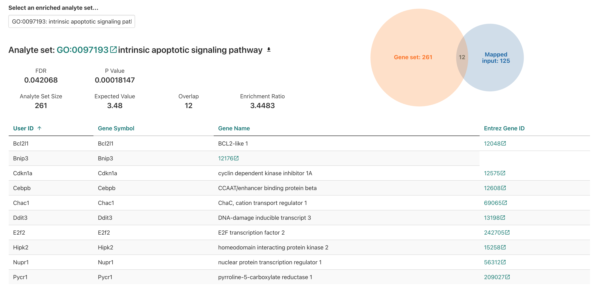 

For the intristic apoptotic signaling pathway, we see ... <!-- add more context -->

For the neuron apoptotic process, would we expect to see similar or difference genes represented for that GO term annotation>?

<!-- add example of neuronal enrichment to show overlap in genes between terms --> 


<!-- transition back to interface and showing how to submit data -->

Next, let's go back to look at the [WebGestalt interface](http://www.webgestalt.org/) and familiarize ourselves with the submission process and documentation. 

# WebGestalt interface

If we look at the [WebGestalt homepage](http://www.webgestalt.org/), we can see that it has several sections:

<!-- map abstract schematics/inputs to WebGestalt 
1) approach
2) database
3) query genes / background -->


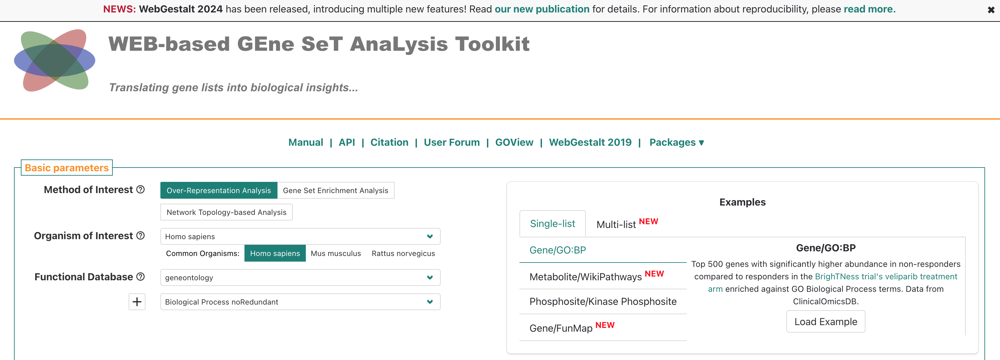
<br>

- At the top, we have the main navigation menu, which includes links including to the Manual, Citation, a User Forum, and a link to the 2019 version of the tool.
- Then, the main section is the "Basic parameters" box, which allows us to select the organism, analysis type, and database.

<br>

  
<br>

- Within the basic parameters box, there is a smaller box that looks like its for specifying the input data, which we'll circle back to shortly.

- Below that, there is a area labeled "Advanced parameters", which we'll skip for now, but that includes options for adjusting the analysis parameters, such as the statistical method and multiple testing correction.

<br>

## WebGestalt documentation

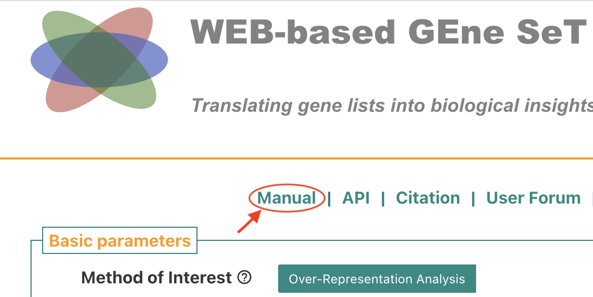  

A good practice when using a new tool is to read the documentation provided by the developers, which we can find by selecting Manual from the top of WebGestalt site.

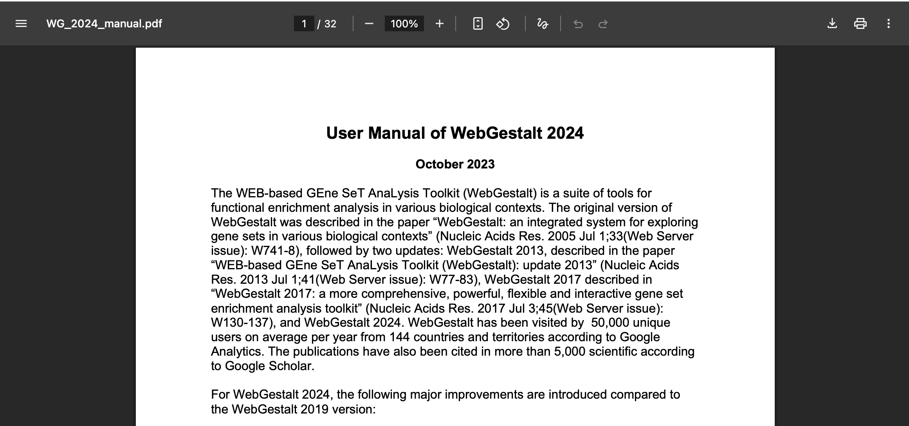  

At the top of the manual page, we can see an overview of some of the related publications as well as a comparison between an older 2019 version and the current 2024 version.


If we scroll down, then we can see a bit of an introduction to the tool. However, the manual seems to already have some terminology and assumptions about a user's familiarity with functional enrichment so let's go back to the tool site and focus on a more limited set of options for our first pass. 


<!-- try to start with results downloaded for RSD DE data -->

# WebGestalt analysis demonstration

Let's start with some of the basic parameters and delve into the options we want to start with. 

<!-- Click through methods to show ORA vs other options & have demo data -->

<!-- Load demo data to show what inputs are needed-->

<!-- Note input gene list options - symbol, entrez, ensembl, etc. which will -->


## Input data

Bulk RNA-seq results from our [RNA-seq demystified workshop](https://umich-brcf-bioinf.github.io/workshop-rnaseq-demystified/main/html/) - statistics from comparision between deficient vs control mice using DESeq2 (file = `DE_results_deficient_vs_control_annotated.csv`)

## Hands-on: Review input data and prepare for analysis
<!-- Consider moving this until after the WebGestalt introduction, so that the learners can see that the tool requires a list of DE vs non-DE for best results -->

To start, we'll load the input data and review it. The data is in CSV format, so we can use `read_csv()` from the `tidyverse` library to load it into R.

```{r, echo=TRUE, message=FALSE, evaluate=FALSE}
# Load necessary libraries
library(tidyverse)

# Check working directory
getwd()

# Load the bulk RNA-seq results
deficient.v.control_bulkDE <- read_csv("../data/de_deficient_vs_control_annotated.csv") #TO REVISE - path may need to be adjusted

# Check the first few rows of the data
head(deficient.v.control_bulkDE)
```

In the table above, we have the following columns:

- `id`: The ENSEMBL gene identifier.
- `symbol`: The gene symbol.
- `baseMean`: The average expression of the gene across all samples.
- `log2FoldChange`: The log2 fold change in expression between the deficient and control
samples.
- `lfcSE`: The standard error of the log2 fold change.
- `stat`: The test statistic for the differential expression test.
- `pvalue`: The p-value for the differential expression test.

A key attribute of this table is that includes statistics for all genes included in the comparison, not just those that are differentially expressed. This allows us to use functional enrichment tools that use both a "positive" set of DE genes and a "background" set of all genes measured in the experiment, like ORA.

Next, we'll prepare the data for analysis by creating a list of DE genes and a background set of all genes. We'll use the `log2FoldChange` and `pvalue` columns to identify DE genes, and we'll use the `gene` column as our gene identifiers.
 
 <!-- include note about reproducibility and knowing thresholds -->

```{r, echo=TRUE, message=FALSE, evaluate=FALSE}
# Generate positive set (DE gene symbols)
deficient_DE_only <- deficient.v.control_bulkDE %>%
  filter(padj < 0.05 & abs(log2FoldChange) > log2(1.5))

deficient_DE_GeneList <- deficient_DE_only %>% pull(symbol) %>% na.omit()

head(deficient_DE_only)
head(deficient_DE_GeneList)
```


```{r, echo=TRUE, message=FALSE, evaluate=FALSE}
# Repeat to generate background set (all gene names)
deficient_background_GeneList <- deficient.v.control_bulkDE %>% pull(symbol) %>% na.omit()
```


```{r, echo=TRUE, message=FALSE, evaluate=FALSE}
# write out to file (text only?)
write(deficient_DE_GeneList, file ="../data/deficient_DE_GeneList.txt", ncolumns = 1)
write(deficient_background_GeneList, file ="../data/deficient_background_GeneList.txt", ncolumns = 1)

```

These outputs then allow us to submit data via the web browser version of WebGestalt.

### Running WebGestalt with our bulk RNA-seq results

<br>

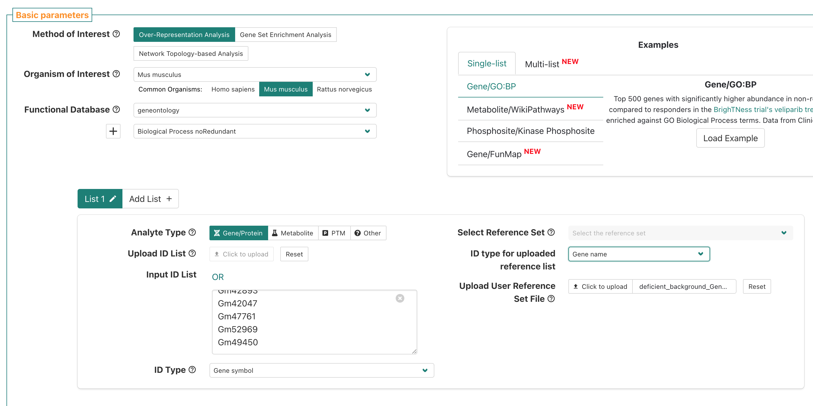  

<br>


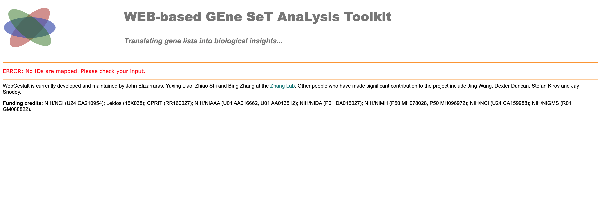  

<br>

We ran into an error - why? Let's go back to the submission page and see if we can find the issue. 


<br>

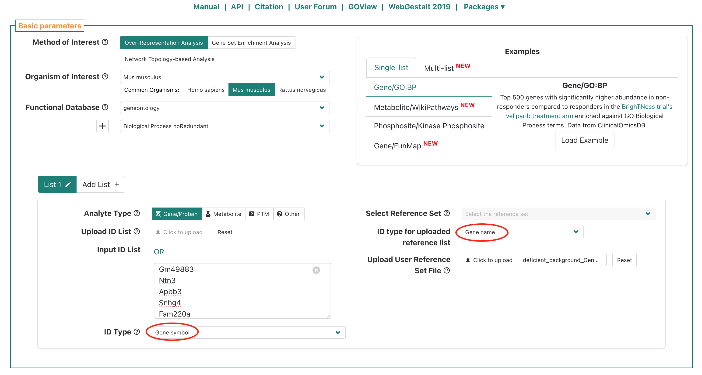  
If we look at the submission page, the `ID type for uploaded reference list` is "Gene name", which doesn't match the ID type we used for our gene list, which was "Gene symbol". Let's change the `ID type for uploaded reference list` to "Gene symbol" and re-submit. 

<br>


---

# Summary

- 1
- 2
- 3


<br/>
<br/>
<hr/>
| [Previous lesson](workshop-intro.html) | [Top of this lesson](#top) | [Next lesson](more-stuff.html) |
| :--- | :----: | ---: |