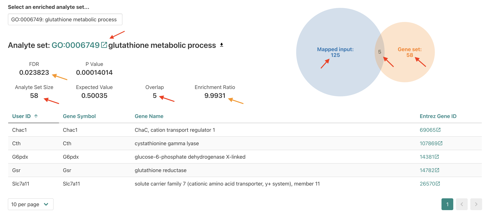

<style type="text/css">

body, td {
   font-size: 16px;
}
code.r{
  font-size: 12px;
}
pre {
  font-size: 12px
}

</style>

```{r klippy, echo=FALSE, include=TRUE}
klippy::klippy(lang = c("r", "markdown", "bash"), position = c("top", "right"))
#getwd()
```

```{r, 'chunk_options', include=FALSE}
source("../bin/chunk-options.R")
knitr_fig_path("02-")
```

```{r, include = FALSE}
source("../bin/set_values.R")
```

<!-- Add wayfinder here -->

<!-- map abstract schematics/inputs to WebGestalt 
1) approach
2) database
3) query genes / background -->

# Objectives

- Introduce "point and click" option for running functional enrichment 
- Run over representation analysis (ORA) using WebGestalt's browser interface
- Understand results and outputs for ORA on bulk RNA-seq data

<br>

# Getting started with functional enrichments

We've discussed some of the motivations and general types of approaches for performing functional enrichment analysis, but what tools can we use to perform these kinds of analyses?

While there are many tools available, [WebGestalt](https://pubmed.ncbi.nlm.nih.gov/15980575/) (WEB-based GEne SeT AnaLysis Toolkit) is an approachable option since it includes a web-based interface that doesn't require any programming knowledge. It also offers several methods for enrichment analysis, can run enrichments for data from a range of organisms, and the authors have [recently updated the tool](https://academic.oup.com/nar/article/52/W1/W415/7684598?login=false/) including expanding what analytes are supported.

We'll start by reviewing the [WebGestalt's browser interface](http://www.webgestalt.org/), focusing on RNA as our analyte and familiarizing ourselves with the options available via the browser interface before submitting our own functional enrichment. 

# WebGestalt interface

If we navigate to the [WebGestalt homepage](http://www.webgestalt.org/), we can see that it has several sections. At the top, is the main navigation menu, which includes links including to the Manual, Citation, a User Forum, and a link to the 2019 version of the tool.

  
<br>

Then, the main section is the left side of the "Basic parameters" box, which includes prompts for:   

- "Method of Interest" - allows selection of which approach to use for functional enrichment, like over-representation Analysis.   
- "Organism of Interest" - selection includes humans, mouse, rat, plus other several other model organisms.  
- "Functional Database" - allows selection of *functional/biological knowledge database* that will be compared to the input data.   

There is also an area on the right where example inputs are provided for the supported analytes/functional database combinations, which can be useful to understanding what format or other attributes for the inputs are required to run the tool. Since we'll be running the tool together, we'll skip the example inputs section for now. 

<br>

<!-- replace with updated figure -->
  
<br>

If we scroll down slightly then we can see a box for providing inputs to WebGestalt, which includes prompts on the left side of the page for:

- "Analyte Type" - allows selection of what was measured in the experiment; for the workshop we'll only be using data from experiments that fall into the `Gene/Protein` category.   
- "Upload ID List" - option to upload a file with *input genes* that will be queried.    
- "Input ID List" - option to paste in list of *input genes* that will be queried.    

On right side are prompts for:

- "Select Reference Set" - options to select general *reference/background gene set* options.    
- "ID type for uploaded reference list" - allows select of ID type for a user provided *reference/background gene* set.    
- "Upload User Reference Set Fle" - allows users to upload a file containing a custom *reference/background gene* set.    

Below that, there is a area labeled "Advanced parameters", that allows some changes to the default options multiple hypothesis correction method and significance cutoff, but we'll also skip that section for now.

<br>
<br>

# WebGestalt browser demonstration

Together we'll walk through the steps to run an over representation analysis (ORA) for bulk RNA-seq results from our [RNA-seq demystified workshop](https://umich-brcf-bioinf.github.io/workshop-rnaseq-demystified/main/html/). 

<!-- Note input gene list options - symbol, entrez, ensembl, etc. which might have different results -->

## Input data

The comparision between deficient vs control mice using DESeq2 generated statistics for each gene; the table of results (`de_deficient_vs_control_annotated.csv`) had the following columns:

- `id`: The ENSEMBL gene identifier.
- `symbol`: The gene symbol.
- `baseMean`: The average expression of the gene across all samples.
- `log2FoldChange`: The log2 fold change in expression between the deficient and control
samples.
- `lfcSE`: The standard error of the log2 fold change.
- `stat`: The test statistic for the differential expression test.
- `pvalue`: The p-value for the differential expression test.

A key attribute of the output table from the original analysis is that includes statistics for all genes included in the comparison, not just those that are differentially expressed.

<!-- add icon for "cooking show" data ? --> 

Behind the scenes, we used the same thresholds as the original analysis for the `log2FoldChange` and `pvalue` columns to identify DE gene. Then we created a list of the IDs for the DE genes, using the `gene` column, and output that list to file. We'll re-create this file together in the next section, but for simplicity we'll accept this pre-made file of DE genes as an input to use for the web browser version of WebGestalt.

<!-- include note about reproducibility and knowing thresholds -->

<!-- Add step to download ? -->


### Running WebGestalt with our bulk RNA-seq results

<br>

  
First, we'll navigate back to the top section of the `Basic parameters` section of the WebGestalt browser interface. The default `Method of Interest` is "Over-Representation Analysis" which also happens to be the type of functional enrichment we want to run right now, so we'll keep that default option. 

<br>


  
<br>

For `Organism of Interest`, since our data is from a mouse experiment we want to select `Mus musculus` to have the appropriate knowledge bases of functional gene sets available for selection. 

  
<br>

For `Functional Database`, we'll select `geneontology` as the category which means we'll be using *functional/biological gene sets* from the [gene ontology (GO) annotations](https://www.geneontology.org/) or per the GO consortium website a "network of biological classes describing the current best representation of the 'universe' of biology" via the [AmiGO 2](https://amigo.geneontology.org/amigo/search/ontology) database.

  
<br>

When we choose `geneontology`, a sub-menu pops up and prompts us to select a funcition database name. 


  
<br>

If we click the sub-menu, a list of options pops up. We'll select the `Biological Process noRedundant` which per WebGestalt's [manual](https://www.webgestalt.org/WG_2024_manual.pdf) is an option the authors created "used an algorithm to remove redundant terms" and is a version of the public Biological Process GO terms that "only contain[s] non-redundant terms". 

  
<br>

Now that we've selected the knowledge base of *functional/biological gene sets*, we can scroll down to the next section of the page to specify the inputs for our enrichment analysis. 

  
<br>

> To upload our DE genes as the input/interest list, we'll share a text file on slack that you will need to download to use as the input file. After you've downloaded the file and located it in the download folder on your computer, put up a green check.

Once we have the input file downloaded, we'll select the `click to upload` option next to the `Upload ID List` label. 

  
<br>

This should open up a prompt that shows the file navigator/finder for your computer. Use the prompt to navigate to your download folder and select the `deficient_DE_GeneList.txt` file that we shared via slack. 

  
<br>

After selecting the file, you should now see the `deficient_DE_GeneList.txt` file name inside a small square next to the upload option. 

<br>

  
<br>

Now that we've specified our interest list of DE genes for the enrichment, we'll need to specify what reference (a.k.a. background) gene list should be used. To use one of the built-in background reference gene sets, we'll click the menu next to `Select Reference Set`. 

  
<br>

If we scroll down we'll see `genome protein-coding`, which is an appropriate background reference to use since a polyA library prep approach used that means we expect protein-coding mRNAs were measured in our experiment so we'll select that option. 

  
<br>

After selecting `genome protein-coding` as our background reference, we should we that displayed on the page and see how the alternative options, which allow for a custom background reference to be used, are greyed out. 

  
<br>

Now let's double check each section - put up a **green check** after you've reviewed and confirmed your selections match the instructor's.  


<br>

Once we've double-checked that our selections match, then we will submit the job to WebGestalt using the `Submit` button.


---

## Overrepresentation results for bulk RNA-seq data using WebGestalt

Let's look through the results from WebGestalt for our ORA (Over Representation Analysis) analysis. We can use the web-interface or a static version of the html report, which one of the files that might be shared by a collaborator. 
<!-- Focus for results is the table (take the most time with that) -->

As a reminder - these results were generated from the DE genes for our bulk RNA-seq experiment, which compared gene expression between erythroblasts, cells that make red blood cells, isolated from wild-type mice fed an iron deficient versus those isolated from wild-type mice fed a control diet.   

<br>

  

Once the submission has run, we see an html format interactive result displayed. We'll navigate through the sections of the report together, starting with the `Job summary`. <!-- add step to or point out how to download results here? -->

Note - if we can't look at the results live, there is a copy of the results available [ADD LINK HERE].

  
<br>

Within the `Job summary` drop down menu, WebGestalt summarizes the data that was submitted and the enrichment parameters. The bulk RNA-seq had 189 DE genes in total but only 180 genes mapped to gene symbols from the tool's reference (`entrezgene`) and then only 125 genes were annotated to the functional categories selected for this analysis, which was `geneontology_Biological_Process_noRedundant`.  

<!-- add section about gene symbol vs gene IDs ? or add DE list output file with ENSEMBL ids instead of Gene symbols??-->

We can also see that the reference list we selected from the available options had 14,490 entrezgene IDs of the total gene list mapped to functional categories within the functional categories we selected. From here, we can scroll down to see the `Enrichment Results` section.

<br>

  
<br>
The report displays a `Bar chart` first in this section. In the plot we can see along the y-axis the top 10 enriched GO-terms for our submitted DE genes from the non-redundant Biological Process GO-term set, which is the default number of terms to display. 

  
<br>

While 10 terms are reported, only 6 are significant after FDR correction for multiple hypothesis testing which is indicated by color (dark blue = FDR < threshold, light blue = FDR < threshold). The length of the bars for each GO term is determined by the "Enrichment ratio" which we'll look at more closely by navigating to the `Table` display option, next to the selected `Bar chart` option above the plot key. <!-- add more detail here?? -->


  
<br>

If we look at the table option next, we can see more detailed information provided for each of the 10 gene sets included in our results. 

  
<br>

1. `Gene set` - Accession number for the GO term.     
1. `Description` - Descriptive label (for Biological function in this case).     
1. `Size` - Total number of genes annotated for that term.    
1. `Expect` - Number of genes expected to be DE for that term based on chance.   
1. `Ratio` - Ratio of observed DE genes over expected for term.    
1. `P Value` - Nominal p-values from statistical comparison, risk of false positives due to number of tests performed.    
1. `FDR` - False Discovery Rate corrected p-values, default method is Benjamini-Hochberg (BH).   

<br>

Now that we have a better understanding of the results table, let's change the ranking to be by `Ratio`.

  
<br>

When we rank the table by `Ratio`, we see that the top significant (FDR =< 0.05) gene set is `glutathione metabolic process` with the `GO:0006749` set ID highlighted as a link. Let's click on the link for `GO:0006749` to see what information that gives us for the `glutathione metabolic process`. 
<br>

### Individual GO-term examples

 
<br>

When we click the GO term accession number, the page jumps to a new section that displays more details for the `glutathione metabolic process` enrichment.  

 
<br>

Within this section we see several familiar fields on the top left, including the `FDR` and `Enrichment ratio` values for this enrichment. We also see the overlap number between the input (a.k.a. interest or query) DE genes and the reference *functional/biological* gene set reported which is how the enrichment ratio is calculated. <!-- add more context, ratio is overlapping genes / expected number (value) -->

On the right we see a diagram showing the number of overlapping genes in the center (5) and then the total number of mapped input DE genes (125) and the total number of genes annotated for the reference (58).

To get more information about the reference term, let's click on the `GO:00067491` link. 

 
<br>

That links out to the AmiGO2 entry for `glutathione metabolic process`, which provides some additional details but isn't necessarily tailored to our specific enrichment (e.g. limited to mouse). 

After reviewing the AmiGO2 page, let's navigate back to the results.

 
<br>


> Based on the experimental design, is finding a enrichment for a metabolic process surprising? Is it surprising to find that this specific process is enriched? 

<!--- add call out box or quote to highlight question ---> 

  

Let's go back to the table and look at some of our other enriched results, selecting the `intrinsic apoptotic signaling pathway` next. 

 
<br>

For the intrinsic apoptotic signaling pathway, we see a higher number of genes overlapping but also a smaller enrichment ratio since the reference gene set and the expected DE genes are larger.  <!-- add more context -->

> Is this enrichment surprising to find for erythroblasts? What does this enrichment suggest about the impact of a iron-deficient diet? 

  
<br>

Let's go back to the table to look at our other results. A potentially unexpected results is the significant enrichment of `neuron apopotic process` for data generated for blood cell progenitors, so let's select that term next. 

 

When we look the neuron apoptotic process, it looks like there are some familiar genes from the `intrinsic apoptotic signaling pathway` which might explain why this term is enriched. While the term is significant, it's probably not very informative since it obviously can't apply to the cell type assayed in this experiment and is unlikely to be worth including in the main body of a paper.

Next, let's click on the link in Entrez Gene ID to see more details about Bcl2l1. 

 
<br>

Although we followed this link from the `neuron apoptotic process` result, it looks like this gene has a function that's not necessarily specific to neurons. 

> Does this gene name look familiar? What are some reasons why we might see a functional annotation like `neuron apoptotic process` enriched for an unrelated cell-type/tissue?

<br>

<!-- if add neuronal, consider noting how it would be helpful to be able to ask which/how many genes are shared between the two GO terms -->

<!-- add example of neuronal enrichment to show overlap in genes between terms later on in workshop --> 

Next, let's go back to the main results and look at the Directed Acyclic Graph (DAG) of the enriched GO terms to see if that provides any insights regarding the `neuron apoptotic process` enrichment. 
<br>

## DAG maps

 
<br>

When we look at the DAG map, we can see that some of the significant terms are related, like `intrinsic apoptotic signaling pathway` and `neuron apoptotic process`. 

This can be useful for interpreting why a GO term that's unlikely to be applicable to the experiment (e.g. neuronal process from non-brain tissue) might be coming up as enriched and further supports how functional enrichment results may need to be curated prior to reporting them, particularly in the body of a paper. 
<br>


---

### WebGestalt documentation

<!-- keep as is or move to hidden drop down? -->

A good practice when using a new tool is to read the documentation provided by the developers, which we can find by selecting Manual from the top of WebGestalt site.

  

At the top of the manual page, we can see an overview of some of the related publications as well as a comparison between an older 2019 version and the current 2024 version.


If we scroll down, then we can see a bit of an introduction to the tool. For the sake of time, we won't go through the manual at this point but it's a useful resource, particularly to search to find terminology that might not be familiar or that might have a specific definition specified by the authors. 

<br>

```{r echo=FALSE, eval=FALSE}
# add section to create output file(s), looking at previous version with file processing


```

---

# Summary

- Learned about the ORA approach for functional enrichment.  
- Used a point and click interface, which has lower friction of use, to run our analysis.   
- However, this point and click approach also makes documenting and sharing *how* to run this analysis more challenging.   


<br/>
<br/>
<hr/>
| [Previous lesson](workshop-intro.html) | [Top of this lesson](#top) | [Next lesson](more-stuff.html) |
| :--- | :----: | ---: |