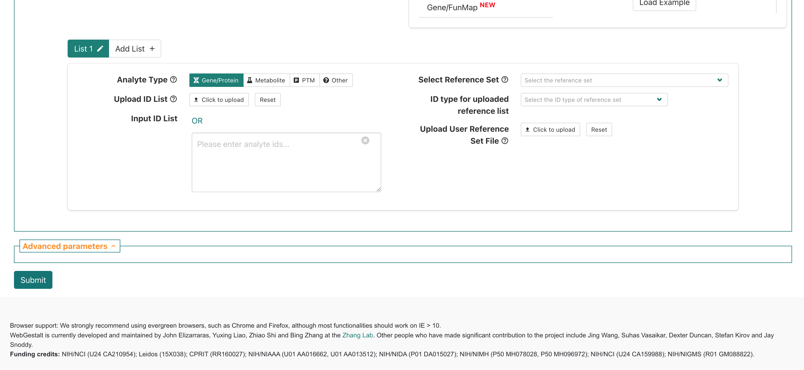

<style type="text/css">

body, td {
   font-size: 16px;
}
code.r{
  font-size: 12px;
}
pre {
  font-size: 12px
}

</style>

```{r klippy, echo=FALSE, include=TRUE}
klippy::klippy(lang = c("r", "markdown", "bash"), position = c("top", "right"))
getwd()
```

```{r, 'chunk_options', include=FALSE}
source("../bin/chunk-options.R")
knitr_fig_path("02-")
```

```{r, include = FALSE}
source("../bin/set_values.R")
```

<!-- Add overall diagram? -->

<!-- map abstract schematics/inputs to WebGestalt 
1) approach
2) database
3) query genes / background -->

# Objectives

- 1
- 2
- 3

...

# Getting started with functional enrichments

We've discussed some of the motivations and general types of approaches for performing functional enrichment analysis, but what tools can we use to perform these kinds of analyses?

While there are many tools available, [WebGestalt](https://pubmed.ncbi.nlm.nih.gov/15980575/) (WEB-based GEne SeT AnaLysis Toolkit) is an approachable option since it includes a web-based interface that doesn't require any programming knowledge. It also offers several methods for enrichment analysis, can run enrichments for data from a range of organisms, and the authors have [recently updated the tool](https://academic.oup.com/nar/article/52/W1/W415/7684598?login=false/) including expanding what analytes are supported.

We'll start by reviewing the [WebGestalt's browser interface](http://www.webgestalt.org/), focusing on RNA as our analyte and familiarizing ourselves with the options available via the browser interface before submitting our own functional enrichment. 

# WebGestalt interface

If we navigate to the [WebGestalt homepage](http://www.webgestalt.org/), we can see that it has several sections. At the top, is the main navigation menu, which includes links including to the Manual, Citation, a User Forum, and a link to the 2019 version of the tool.

  
<br>

Then, the main section is the left side of the "Basic parameters" box, which includes prompts for:   

- "Method of Interest" - allows selection of which approach to use for functional enrichment.   
- "Organism of Interest" - selection includes humans, mouse, rat, plus other several other model organisms.  
- "Functional Database" - allows selection of functional/biological knowledge database that will be compared to the input data.   

There is also an area on the right where example inputs are provided for the supported analytes/functional database combinations, which can be useful to understanding what format or other attributes for the inputs are required to run the tool. Since we'll be running the tool together, we'll skip the example inputs section for now. 

<br>

<!-- replace with updated figure -->
  
<br>

If we scroll down slightly then we can see a box for providing inputs to WebGestalt, which includes prompts on the left side of the page for:

- "Analyte Type" - allows selection of what was measured in the experiment; for the workshop we'll only be using data from experiments that fall into the `Gene/Protein` category.   
- "Upload ID List" - option to upload a file with input genes.    
- "Input ID List" - option to paste in list of input genes.    

On right side are prompts for:

- "Select Reference Set" - options to select general reference/background gene set options.    
- "ID type for uploaded reference list" - allows select of ID type for a user provided reference/background gene set.    
- "Upload User Reference Set Fle" - allows users to upload a file containing a custom reference/background gene set.    

Below that, there is a area labeled "Advanced parameters", that allows some changes to the default options multiple hypothesis correction method and significance cutoff, but we'll also skip that section for now.

<br>


# WebGestalt browser demonstration

Together we'll walk through the steps to run an over representation analysis (ORA) for bulk RNA-seq results from our [RNA-seq demystified workshop](https://umich-brcf-bioinf.github.io/workshop-rnaseq-demystified/main/html/). 

<!-- Note input gene list options - symbol, entrez, ensembl, etc. which will -->

<!-- Focus for results is the table (take the most time with that) -->

## Input data

The comparision between deficient vs control mice using DESeq2 generated statistics for each gene; the table of results (`de_deficient_vs_control_annotated.csv`) had the following columns:

- `id`: The ENSEMBL gene identifier.
- `symbol`: The gene symbol.
- `baseMean`: The average expression of the gene across all samples.
- `log2FoldChange`: The log2 fold change in expression between the deficient and control
samples.
- `lfcSE`: The standard error of the log2 fold change.
- `stat`: The test statistic for the differential expression test.
- `pvalue`: The p-value for the differential expression test.

A key attribute of the output table from the original analysis is that includes statistics for all genes included in the comparison, not just those that are differentially expressed.

<!-- add icon for "cooking show" data ? --> 

Behind the scenes, we used the same thresholds as the original analysis for the `log2FoldChange` and `pvalue` columns to identify DE gene. Then we created a list of the IDs for the DE genes, using the `gene` column, and output that list to file. We'll re-create this file together in the next section, but for simplicity we'll accept this pre-made file of DE genes as an input to use for the web browser version of WebGestalt.

<!-- include note about reproducibility and knowing thresholds -->

<!-- Add step to download ? -->


### Running WebGestalt with our bulk RNA-seq results

<br>

  
First, we'll navigate back to the top section of the `Basic parameters` section of the WebGestalt browser interface. The default `Method of Interest` is "Over-Representation Analysis" which also happens to be the type of functional enrichment we want to run right now, so we'll keep that default option. 

<br>


  
<br>

  
<br>


  
<br>


  
<br>

  
<br>

  
<br>

  
<br>

  
<br>


<br>

  
<br>


  
<br>


  
<br>

  
<br>

Once we've double-checked our options, then we can submit the ORA job using the `Submit` button.


---

## Overrepresentation results for bulk RNA-seq data using WebGestalt

<!-- per group discussions - plan to move this section to the start to give an overview of the results before using the tool -->

Let's look through an example of ORA (Over Representation Analysis) report from WebGestalt, similar to what might be shared by a collaborator. These results were generated for our bulk RNA-seq data, which compared gene expression between <!-- what was in the input tissue??--> wild-type mice fed a iron deficient vs control diet. 

<!-- TO ADD - figure of experimental design from RSD --> 

We'll go through the steps for how to run ORA using the browser version together shortly but let's first look through what WebGestalt reports and what results we can expect.

<br>

  
At the top of the report, WebGestalt summarizes what was submitted. The bulk RNA-seq had 189 DE genes in total but only 180 genes mapped to gene symbols of the tool's reference (`entrezgene`) and then only 125 genes were annotated to the functional categories selected for this analysis, which was `geneontology_Biological_Process_noRedundant`. 

We can also see that the reference list was user provided (`upload/deficient_background_GeneList_XXXXXX.txt`) and that 14992 and 9375 were mapped to entrezgene gene symbols and functional catagories, respectively.

<br>

  
Next, we can see the top 10 enriched GO-terms for our submitted DE genes from the non-redundant Biological Process GO-term set. While 10 terms are reported, only 4 are significant after FDR multiple hypothesis correction. <!-- add more detail here?? -->

  

Next, we can see the top 10 enriched GO-terms for our submitted DE genes from the non-redundant Biological Process GO-term set. While 10 terms are reported, only 4 are significant after FDR multiple hypothesis correction.

  

If we look at the DAG map of GO terms included in the report, we can see that some of the significant terms are related, like `intrinsic apoptotic signaling pathway` and `neuron apoptotic process`. This can be useful for interpreting why a GO term that's unlikely to be applicable to the experiment (e.g. neuronal process from non-brain tissue) might be coming up as enriched. 

<!-- change to dropdown? -->
  

### Individual GO-term examples

Next let's look at some of the significantly enriched terms.

 

Starting with glutathione metabolic process we see ... <!-- add more context -->

Based on the experimental design, is finding a enrichment for a metabolic process surprising? Is it surprising to find that this specific process is enriched? <!--- add call out box or quote to highlight question ---> 

Let's look at some of our other enriched results. 

 

For the intrinsic apoptotic signaling pathway, we see ... <!-- add more context -->

For the neuron apoptotic process, would we expect to see similar or difference genes represented for that GO term annotation>?

<!-- add example of neuronal enrichment to show overlap in genes between terms --> 

<!-- if add neuronal, consider setting up how it would be helpful to be able to ask which/how many genes are shared between the two GO terms -->

---

## WebGestalt documentation

<!-- keep as is or move to hidden drop down? -->

  

A good practice when using a new tool is to read the documentation provided by the developers, which we can find by selecting Manual from the top of WebGestalt site.

  

At the top of the manual page, we can see an overview of some of the related publications as well as a comparison between an older 2019 version and the current 2024 version.


If we scroll down, then we can see a bit of an introduction to the tool. However, the manual seems to already have some terminology and assumptions about a user's familiarity with functional enrichment so let's go back to the tool site and focus on a more limited set of options for our first pass. 


<!-- try to start with results downloaded for RSD DE data -->

---

# Summary

- 1
- 2
- 3


<br/>
<br/>
<hr/>
| [Previous lesson](workshop-intro.html) | [Top of this lesson](#top) | [Next lesson](more-stuff.html) |
| :--- | :----: | ---: |