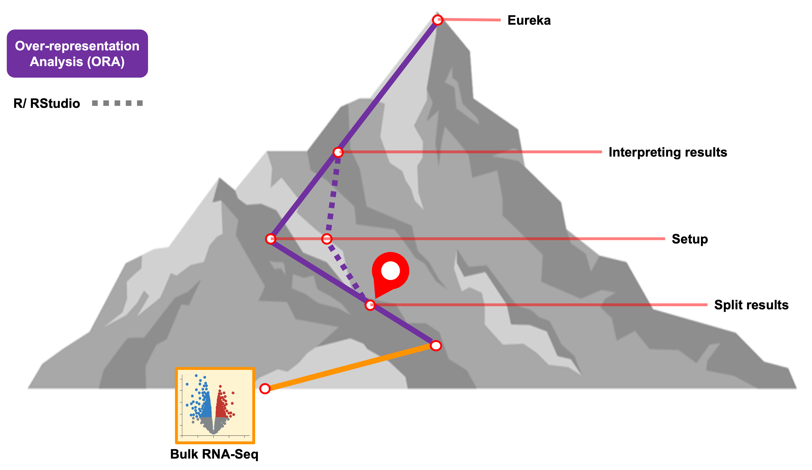
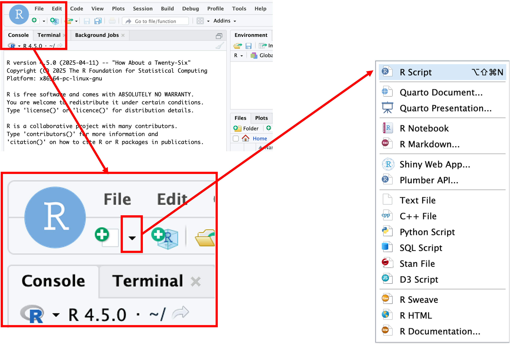
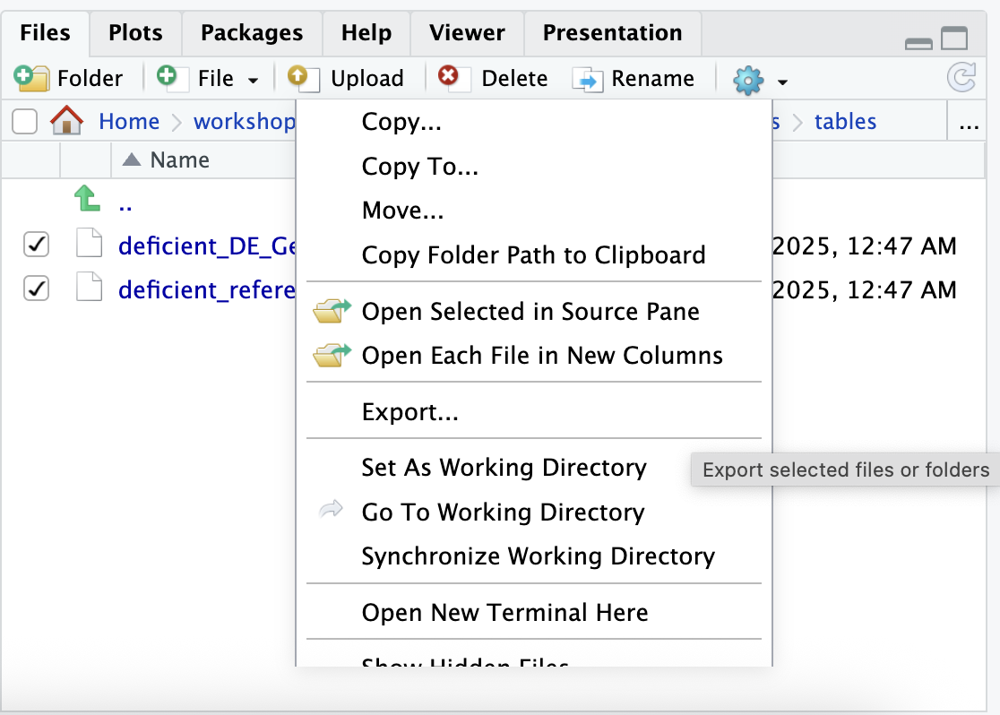

<style type="text/css">

body, td {
   font-size: 16px;
}
code.r{
  font-size: 12px;
}
pre {
  font-size: 12px
}

</style>

```{r klippy, echo=FALSE, include=TRUE}
klippy::klippy(lang = c("r", "markdown", "bash"), position = c("top", "right"))
#getwd()
```

```{r, 'chunk_options', include=FALSE}
source("../bin/chunk-options.R")
knitr_fig_path("02-")
```

```{r, include = FALSE}
source("../bin/set_values.R")
```


<br>

# Objectives

- Generate the inputs for over-representation analysis (ORA) in WebGestaltR from a differential expression analysis.
- Use WebGestaltR to do an ORA analysis.
- Understand how to interpret the results of ORA analysis.

# Getting started

As we have seen with the web interface for WebGestalt, an over-representation analysis on differential expression results requires:

- An *input* list of differentially expressed - subject to cutoffs for significance - that will be queried.    
- A *reference/background gene set* of genes that are expected to have be measured in the experiment
- The *functional/biological knowledge database*  which defines the gene sets that will be used to test for over-representation.

In addition to the browser version of `WebGestalt`, the authors also created an [R package called `WebGestaltR`](https://bzhanglab.github.io/WebGestaltR/) that can be used to run the tool in R instead of by using their webserver. This allows us to run functional enrichments in a more reproducible manner since we can record the exact inputs and parameters used.

# Orienting on RStudio

To get started, let's **log in to the workshop server by going here**: [`r workshop_vars$rstudio_server_url`](`r workshop_vars$rstudio_server_url`){target="blank"}
<br>

The login page for the server looks like:


<br>

Enter your user credentials and click <kbd>Sign In</kbd>. The RStudio interface should load and look something like:


<br>

**Checkpoint** - after you've logged in put up a green check; if you need help put up a red check and post in slack. 

RStudio is an integrated development environment where you can write, execute, and see the results of your code. The interface is arranged in different panes:

- The **Console pane** along the left where you can enter commands and execute them.
- The **Environment pane** in the upper right shows any variables you have created, along with their values.
- The pane in the lower right has a few functions:
    - The **Files tab** let's you navigate the file system.
    - The **Plots tab** displays any plots from code run in the Console.
    - The **Help tab** displays the documentation of functions.

## Commands in the Script

When first opening RStudio, a script file is not automatically opened. We'll create our script file to record our analysis and make it more reproducible by clicking on the icon in the upper-left of the interface (a blank piece of paper with a + sign), and selecting <KBD>R Script</KBD>.


<br>

The new pane that opens is the **Source pane**:


<br>

Notice that if we press <KBD>Enter</KBD> in the Source pane, we get a new line instead of running the code. 

In order to execute code, we press <KBD>Ctrl + Enter</KBD> either on the single line we want to run, or on a highlighted block of code. For example if we type in the script file:

~~~
3+2
~~~

We then see that code executed, along with its result in in the Console pane.


## Summary: Console vs Script

Here are some of the key differences between the Console and Script panes in RStudio:

| Console          | Script            |
|:-----------------|:------------------|
| Ephemeral code        | Preserved code         |
| Run with <KBD>Enter</KBD> | Run with <KBD>Ctrl + Enter</KBD> |                  |
| Hard to share    | Easy to share     |

## Configuring RStudio

All of the panes in RStudio have configuration options. For example, you can minimize/maximize a pane or resize panes by dragging the borders. The most important customization options for pane layout are in the <KBD>View</KBD> menu. Other options such as font sizes, colors/themes, and more are in the <KBD>Tools</KBD> menu under <KBD>Global Options</KBD>.

We can enable soft-wrapping of code by selecting <KBD>Code</KBD> and then <KBD>Soft Wrap Long Lines</KBD>.


# Workshop flow

To accomodate learning styles and to keep us moving along, we'll provide code in three different ways, and you can get that code into RStudio in corresponding ways:

| Source of Code   | Execution of Code |
|:-----------------|:------------------|
| Zoom screen share            | Type the code yourself.                            |
| Slack            | Copy and paste code into RStudio.                  |
| Website          | Use code block copy button and paste into RStudio. |

**Questions?**

# Setting up

Before we begin, the folder structure of a working directory / project organizes all the relevant files. Typically we make directories for the following types of files:

- Raw data, called `data`, `input`, etc,
- Results, often `results` or `output` with subfolders for `tables`, `figures`, and `rdata`, and
- Scripts, often `scripts`.

We've already provided the raw data in the `inputs/` folder, but you'd otherwise want to move the starting, unaltered, data into this folder.

## Creating directory stucture

Before we start creating directories, let's make sure we're in the right location. To print the current working directory:

```{r getwd, eval = FALSE}
# =========================================================================
# Day 1 - Getting Started with Functional enrichment
# =========================================================================

# -------------------------------------------------------------------------
# Get current working directory
getwd()
```

This means that any references to files loaded or files saved **is with respect to this location**. This can simplify our code a bit by allowing us to use relative paths rather than full paths. Let's set our working directory to the ISC folder in our respective home directories.

```{r setwd, eval = FALSE}
# -------------------------------------------------------------------------
# Set current working directory
setwd('~/IFUN_R')
```

Now that we're sure of our working directory, let's create some folders for our analysis scripts and results thereof.

```{r create_structure}
# -------------------------------------------------------------------------
# Create directory structure

dir.create('scripts', recursive = TRUE, showWarnings = FALSE)
dir.create('results/figures', recursive = TRUE, showWarnings = FALSE)
dir.create('results/tables', recursive = TRUE, showWarnings = FALSE)
dir.create('results/rdata', recursive = TRUE, showWarnings = FALSE)
```

## Saving scripts

Let's save our currently open script in the `scripts/` folder as `IFUN_day1.R` by clicking <KBD>File</KBD> and then <KBD>Save</KBD>.


# Using WebGestaltR

To start, we'll load the `WebGestaltR` library along with `tidyverse`, which we'll use for data processing and visualization. Both packages were both pre-installed on the workshop server but later in the workshop we'll discuss how to use these packages on other compute resources like GreatLakes. 

```{r load_webgestalt}
# =========================================================================
# ORA with WebGestlatR
# =========================================================================

# -------------------------------------------------------------------------
# Load the libraries
library(WebGestaltR)
library(tidyverse)
```

*Note* - when loading `tidyverse` you will likely see some red text. Remember that this is an informative message about the package loading and functions that share names between multiple source packages, not a warning or error. 
<br>

Let's look at the documentation for the main function in WebGestaltR to understand how to input these required objects into the function. Think of it as reading the recipe before you start cooking.

```{r webgestalt_doc, eval = FALSE}
# -------------------------------------------------------------------------
# Look at the manual for the main function
?WebGestaltR
```

There are a lot of arguments that go into this function, but, like many other R functions, we won't need or use all of them. Let's focus on the arguments we'll be using, while noting some of the defaults.

- `enrichMethod` is the method used for the functional enrichment. We will use `'ORA'` for this part of the workshop.
- `organism` is the organism used for the experiment. The selection helps WebGestaltR extract the correct genes for the correct gene sets. 
- `enrichDatabase` are the *functional/biological knowledge database* with the genesets and pathways that will be compared to the input data    

We can use the `listOrganism()` function to see all available `organisms` available for the package, and, importantly, how they're labeled. We can expect that the organism ID will need to be matched exactly in both spelling and case when specifying that argument.

```{r organisms}
# -------------------------------------------------------------------------
# List available organisms
listOrganism()
```
<br>

To see what functional databases are available from the tool, we can see the `listGeneSet()` function to see the available genesets for specific organisms. For this function, we need to specify `mmusculus` as the organism to have the appropriate references listed.

```{r listGeneSet}
# -------------------------------------------------------------------------
# List available reference genesets for mmusculus
listGeneSet(organism = 'mmusculus')
```

Here we should see some familar options, including `geneontology_Biological_Process_noRedundant`.

Continuing with the arguments for the `WebGestaltR()` function: 

- `interestGene` for ORA this should be a vector of gene identifiers for a set of differentially expressed "interest" genes. 
- `interestGeneType` is the type of identifier used to describe the genes. 

We can use the `listIdType()` function to see which identifiers are available for which organisms, adding on a `tail()` to look at a subset. We will be using the `'genesymbol'` type, but note the presence of `'ensemble_gene_id'` and `'entrezgene'`, among other common (and not-so-common) identifiers.

```{r listIdType}
# -------------------------------------------------------------------------
# List gene identifier types for mmusculus
listIdType(organism = 'mmusculus') %>% tail(25)
```


Continuing with the arguments for the function:

- `referenceGene` is also a vector of gene identifiers, but this is the background set of genes. Unlike the browser option, here will use all the genes tested for differential expression in the DE analysis, noting that this itself implies some prior filtering.
- `referenceGeneType` is again the type of identifier used, but to describe the reference set.
- `fdrThr` refers to the significance threshold for the `fdr` method (by default the Benjamini-Hochberg FDR correction). The default is `fdrThre = 0.05`, but you may want to relax this threshold to see what genesets are "close" to significance, depending on the limitations of the DE results and downstream goals.
- `outputDirectory` and `projectName` are used to specify where to put results and what to call them. By default, `WebGestaltR()` has rich output in the form of supporting files, but also an HTML report (just like the web-version) that summarizes the results and provides helpful visualizations.

We can think of the above arguments as the minimum necessary for an over-representation analysis. Now let's read in the differential expression results, and create the right inputs for the ORA.

## Read in diffex results

For our first ORA, we will use the differential expression results from the same bulk RNA-seq data we used in the browser-based analysis from the RNA-seq Demystified workshop [(link)](https://umich-brcf-bioinf.github.io/workshop-rnaseq-demystified/main/html/Module07_DESeq2Init.html#Sample_Information).

We have provided these differential results as a CSV file, which we can read in with the `read_csv()` function:

```{r rsd_read}
# -------------------------------------------------------------------------
# Read diffex results
rsd_diffex = read_csv('inputs/bulk_de_results/de_deficient_vs_control_annotated.csv')
```

As always, it's helpful to look at the result of what we read in to get a sense for how to work with it:

```{r rsd_preview}
# -------------------------------------------------------------------------
head(rsd_diffex)
```

## Extracting genes for ORA

We can see some of the typical output from DESeq2, including a gene identifier (or two), overall expression, log fold-change, p-value, and adjusted p-value (FDR). As we saw in the documentation for `WebGestaltR()`, we'll need two lists of gene identifiers:

1. `interestGene`: The gene identifiers representing the DE genes, and 
2. `referenceGene`: The gene identifiers representing a background set of genes, ideally all genes tested in the DE analysis.

For simplicity, and slightly easier interpretability, let's use the gene symbol column. It's always a good idea to see how many identifiers are NA, and remove them because they can't be used in the analysis anyhow.

```{r rsd_na}
# -------------------------------------------------------------------------
# How many symbols are NA?
table(is.na(rsd_diffex$symbol))

# -------------------------------------------------------------------------
# Filter out the NAs
rsd_diffex = rsd_diffex %>% dplyr::filter(!is.na(symbol))

# Verify we have fewer by noting dimension of resulting table
rsd_diffex
```

Let's start with the reference set because it doesn't require any filtering:

```{r rsd_reference_set}
# -------------------------------------------------------------------------
# Pull all genes tested
rsd_ref_ora = rsd_diffex %>% pull(symbol)

# -------------------------------------------------------------------------
# Preview the vector
head(rsd_ref_ora)

# -------------------------------------------------------------------------
# How big is the custom background?
length(rsd_ref_ora)
```

Next, let's extract the significantly differentially expressed genes. We'll use the same thresholds used to call DE genes in the original analysis - a "typical" significance threshold of FDR < 0.05 and |log2FC| > log2(1.5). 

```{r rsd_interest_set}
# -------------------------------------------------------------------------
# Pull diffex genes
rsd_sig_ora = rsd_diffex %>%
    dplyr::filter(padj < 0.05 & abs(log2FoldChange) > log2(1.5)) %>%
    pull(symbol)

# -------------------------------------------------------------------------
# Preview the vector
head(rsd_sig_ora)

# -------------------------------------------------------------------------
# How many significant genes are there?
length(rsd_sig_ora)
```


## Write out gene lists to file

We can write out the list of DE interest genes to file re-create the input file we uploaded for the browser-based WebGestalt analysis as well as output to file the custom reference/background gene list. 

```{r output_ORA}
# -------------------------------------------------------------------------
# Write out list of DE interest genes to file
write_lines(rsd_sig_ora, file="./results/tables/deficient_DE_GeneList.txt")

# -------------------------------------------------------------------------
# Write out custom reference/background set of genes to file
write_lines(rsd_ref_ora, file="./results/tables/deficient_reference_GeneList.txt")
```

To download these tables, we can use the file viewer tab to navigate to the `tables` subdirectory within our `results` directory, select the two files, and then use the blue <KBD>Gear</KBD> symbol on the top right of the pane to select `Export`. After re-naming the export `tables-export.zip` and selecting <KBD>Download</KBD>, the files should be in a zipped folder in the downloads folder on your computer.  



<br>

# Running ORA

We now have an understanding of the important parameters and vectors of genes prepared to follow through with the over-representation analysis. For demonstrative purposes we will start with the same non-redundant version of the Gene Ontology Biological Process genesets used in the web version. <!-- repeat for 'pathway_KEGG' -->

```{r rsd_go_ora}
# -------------------------------------------------------------------------
# ORA on bulk RNA-seq DESeq2 results with GO - Biological Process knowledge base
rsd_ora_result = WebGestaltR(
    enrichMethod = 'ORA',
    organism = 'mmusculus',
    enrichDatabase = c('geneontology_Biological_Process_noRedundant'),
    interestGene = rsd_sig_ora,
    referenceGene = rsd_ref_ora,
    interestGeneType = 'genesymbol',
    referenceGeneType = 'genesymbol',
    fdrThr = 0.1,
    outputDirectory = './results',
    projectName = 'deficient_vs_control_ORA-GO_BP')

# -------------------------------------------------------------------------
# View the first few results
head(rsd_ora_result)
```

The columns of the table are similar to the results displayed in the web-version with some additional details:

- `geneSet`: The database-specific identifier for the geneset/pathway.
- `description`: A readable description of the geneset/pathway.
- `link`: A link to the corresponding database giving more detail about the geneset/pathway.
- `size`: The number of genes in the geneset.
- `overlap`: The number of significantly differentially expressed genes from your dataset overlapping the geneset.
- `expect`: The expected number of input genes annotated to the geneset.
- `enrichmentRatio`: The actual / expected overlap.
- `pValue`: the p-value from the hypergeometric test.
- `FDR`: The corrected p-value using the Benjamini-Hochberg method.
- `overlapID`: The Entrez Gene IDs overlapping the geneset.
- `database`: The database of the geneset.
- `userId`: The user-supplied gene ID overlapping the geneset.


To expand our analysis and aid with interpretation of our DE results, we'll run a second enrichment adding a different knowledge base called [KEGG (Kyoto Encyclopedia of Genes and Genomes)](https://www.genome.jp/kegg/) that per the website "is a database resource for understanding high-level functions and utilities of the biological system". Broadly speaking, KEGG includes gene sets for known pathways as well as other functional annotations. Here we'll also diverge from our previous enrichment by reducing the maximum gene number per category to limit the comparison to smaller, more specific categories.

```{r rsd_go_ora}
# -------------------------------------------------------------------------
# ORA on bulk RNA-seq DESeq2 results with KEGG knowledge base
rsd_ora_kegg_result = WebGestaltR(
    enrichMethod = 'ORA',
    organism = 'mmusculus',
    enrichDatabase = c('pathway_KEGG'),
    interestGene = rsd_sig_ora,
    referenceGene = rsd_ref_ora,
    interestGeneType = 'genesymbol',
    referenceGeneType = 'genesymbol',
    fdrThr = 0.1,
    maxNum = 60,
    outputDirectory = './results',
    projectName = 'deficient_vs_control_ORA-KEGG')

# -------------------------------------------------------------------------
# View the first few results
head(rsd_ora_kegg_result)
```
Although we limited the comparisons to more specific terms, we only find two pathways that have significant enrichment below an FDR < 0.10 threshold. This could be because the treatment doesn't impact a specific pathway or it could be due to the limits of ORA, which requires we subset our measured genes into DE and non-DE and also doesn't utilize the effect size data (e.g. fold-change).

<!-- TODO: Here is where we'll actually talk more about the biological relevance of the results and pat ourselves on the back for our first ORA well done. -->

# Results of ORA

The R package for WebGestalt outputs a number of useful artifacts to an `outputDirectory` and `projectName` of our choosing. Some of the more important output files are:

- `enrichment_results_{project name}.txt`: A tab-delimited text table of the full results which can be read in Excel. It is the same as the `rsd_ora_result` table.
- `interestingID_mappingTable_{project name}.txt`: A table of the `interestGene` vector, with user-supplied identifiers and mappings to other identifiers.
- `interestingID_unmappedList_{project_name}.txt`: The identifiers which could not be mapped. **This may be helpful to know if any key genes were dropped from the analysis.**
- `Report_{project_name}.html`: An HTML report, like the web application, of the results. This may be more suitable for a first glance and if we review it, it looks quite familiar.

<!-- enrichment_results_deficient_vs_control_ORA_GO_BP = file with terms and list of genes (in column "userId", split by semi-columns -->

# Summary

In this section, we performed our first ORA with the WebGestalt R package. In so doing, we accomplished the following objectives:

- Form the inputs for over-representation analysis (ORA) in WebGestaltR from a differential expression analysis.
- Use WebGestaltR to do an ORA analysis.
- Understand how to interpret the results of ORA analysis.

# Questions

- What are the advantages of running WebGestaltR over using the browser version?
- What differences in the results might you expect if an identifier other than the gene symbol was used?

<br/>
<br/>
<hr/>
| [Previous lesson](02-IntroToWebGestaltandORA.html) | [Top of this lesson](#top) | [Next lesson](04-gene-set-references.html) |
| :--- | :----: | ---: |