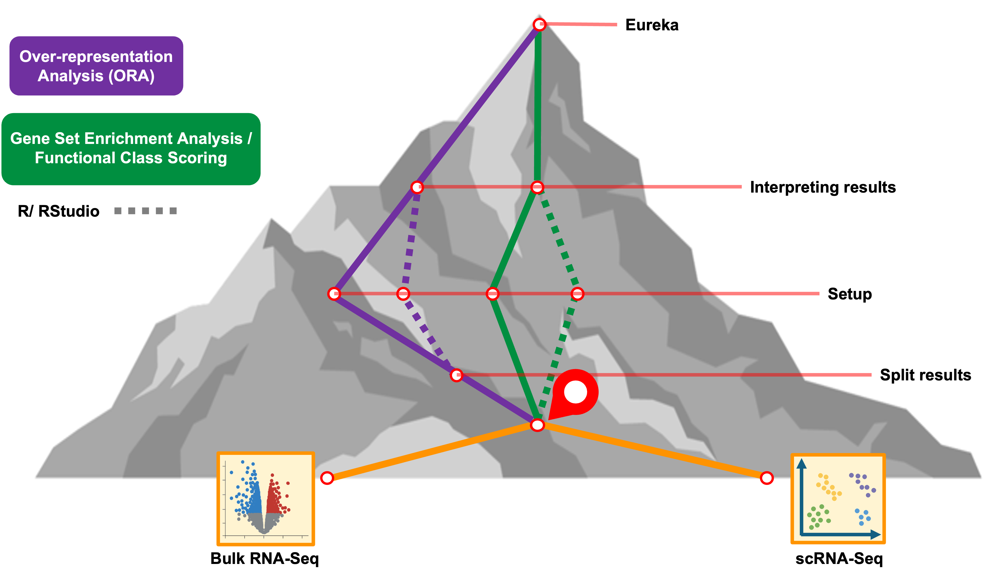

<style type="text/css">

body, td {
   font-size: 16px;
}
code.r{
  font-size: 12px;
}
pre {
  font-size: 12px
}

</style>

```{r klippy, echo=FALSE, include=TRUE}
klippy::klippy(lang = c("r", "markdown", "bash"), position = c("top", "right"))
```

```{r, 'chunk_options', include=FALSE}
source("../bin/chunk-options.R")
knitr_fig_path("02-")
```

```{r, include = FALSE}
source("../bin/set_values.R")
```


# Objectives

- Form the inputs for Gene Set Enrichment Analysis (GSEA) in WebGestaltR from a differential expression analysis.
- Use WebGestaltR to do a GSEA analysis.
- Understand how to interpret the results of GSEA analysis.
- Compare and contrast the results of two GSEA results.

# Getting started


The setup for GSEA is similar to ORA, but there are two key differences:

1. We do not require a threshold for significance, and
2. We need to pass gene identifiers **and** the log fold-change for the gene from the differential expression test.

# Running GSEA using WebGestalt

Again, we will take a look at the documentation for the `WebGestaltR()` function, and note the difference in input between ORA and GSEA.

```{r load_webgestalt}
# =========================================================================
# ORA with WebGestlatR
# =========================================================================

# -------------------------------------------------------------------------
# Load the libraries
library(WebGestaltR)
library(tidyverse)
```

```{r webgestalt_doc, eval = FALSE}
# -------------------------------------------------------------------------
# Look at the manual for the main function
?WebGestaltR
```

We note from the documentation that `interestGene` "should be an R data.frame object containing two columns: the gene list and the corresponding scores." We also note that we will **not** make use of the `referenceGene` argument.

## Read in diffex results

We will demonstrate GSEA on a differential analysis from the single-cell RNA-seq experiment we explored in the Introduction to Single-cell Analysis [(link)](https://umich-brcf-bioinf.github.io/workshop-intro-single-cell/main/html/00A-OrientingOnScRNASeq.html#Consider_a_specific_scRNA-Seq_experiment). In particular, we perform GSEA on the differential expression results in the pericyte cluster, comparing day 21 to day 7.

```{r isc_read}
# -------------------------------------------------------------------------
# Load pseudo-bulk analysis for D21 vs D7 in pericyte cluster
isc_d21_v_d7 = read_csv('inputs/single_cell_de_results/de_pseudo_pericyte_D21_vs_D7.csv')

# -------------------------------------------------------------------------
# Preview the result
head(isc_d21_v_d7)
```

## Extracting data for GSEA

The key columns to extract, as per the documentation, are the `gene` and `avg_log2FC` columns. As before, we'll want to see how many gene symbols are NA and remove them.

```{r isc_na}
# -------------------------------------------------------------------------
# How many symbols are NA?
table(is.na(isc_d21_v_d7$gene))

# -------------------------------------------------------------------------
# Filter out the NAs
isc_d21_v_d7 = isc_d21_v_d7 %>% dplyr::filter(!is.na(gene))

# Verify we have fewer by noting dimension of resulting table
isc_d21_v_d7
```

And now we can create a table with just the `gene` and `avg_log2FC` columns with the `select()` function from `dplyr`:

```{r isc_interest_set}
# -------------------------------------------------------------------------
# Select gene and avg_log2FC columns
isc_d21_v_d7_gsea = isc_d21_v_d7 %>%
    dplyr::select(gene, avg_log2FC)

# -------------------------------------------------------------------------
# Preview the table
head(isc_d21_v_d7_gsea)
```

# Running GSEA

As with the ORA, we will perform GSEA on the KEGG pathways and a non-redundant version of the Gene Ontology Biological Process genesets.

```{r isc_gsea}
isc_d21_v_d7_gsea_result = WebGestaltR(
    enrichMethod = 'GSEA',
    nThreads = 8,
    organism = 'mmusculus',
    enrichDatabase = c('pathway_KEGG', 'geneontology_Biological_Process_noRedundant'),
    interestGene = isc_d21_v_d7_gsea,
    interestGeneType = 'genesymbol',
    fdrThr = 0.1,
    outputDirectory = './results',
    projectName = 'D21_v_D7_GSEA')

# -------------------------------------------------------------------------
# View the first few results
head(isc_d21_v_d7_gsea_result)
```

The columns of the GSEA results are quite similar to the ORA results, with the following exceptions:

- `enrichmentScore`: 
- `normalizedEnrichmentScore`:
- `leadingEdgeNum`: 

TODO: Here is where we'll actually talk more about the biological relevance of the results.

# Results of GSEA

As with the ORA results, the GSEA method outputs similar results tables, gene identifier mappings, and HTML reports. Additionally, for each pathway with `FDR < fdrThr`, a GSEA enrichment plot is automatically generated. The following is an example:

TODO: Include example GSEA plot.





# Exercise

# Comparing enrichment results

Now that we have two GSEA results from related differential expression results, we may want to know:

- What genesets are in common?
- What genesets are unique?
- Are there any insights in the pathways at one time point versus another?

A first approach to these questions might be to take the GSEA results from both comparisons and join them on the geneset identifier.


# Summary

# Questions


| [Previous lesson](05-fcs-gsea-overview.html) | [Top of this lesson](#top) | [Next lesson](07-advanced-visualizations.html) |
| :--- | :----: | ---: |