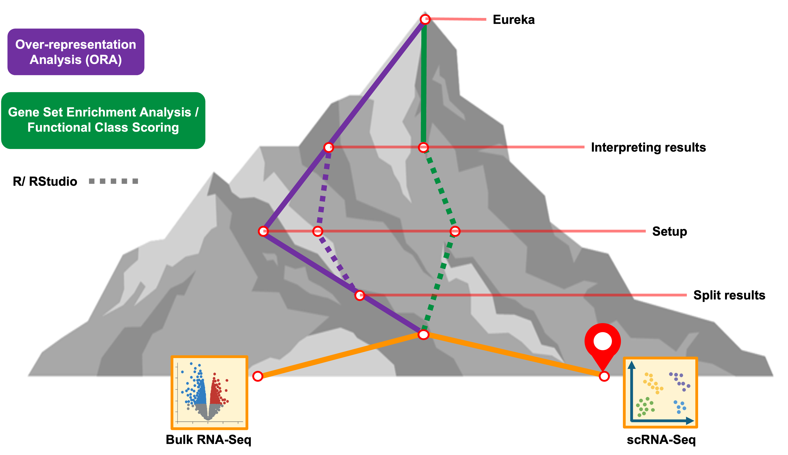
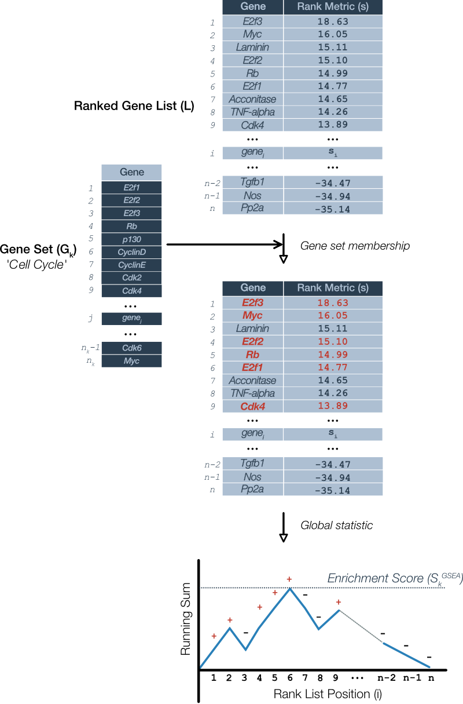

<style type="text/css">

body, td {
   font-size: 16px;
}
code.r{
  font-size: 12px;
}
pre {
  font-size: 12px
}

</style>

```{r klippy, echo=FALSE, include=TRUE}
klippy::klippy(lang = c("r", "markdown", "bash"), position = c("top", "right"))
```

```{r, 'chunk_options', include=FALSE}
source("../bin/chunk-options.R")
knitr_fig_path("02-")
```

```{r, include = FALSE}
source("../bin/set_values.R")
```



# Objectives

- Form the inputs for Gene Set Enrichment Analysis (GSEA) in WebGestaltR from single-cell results.
- Use WebGestaltR to do a GSEA analysis.
- Understand how to interpret the results of GSEA analysis.
- Compare and contrast the results of two GSEA results.

# Getting started

The setup for GSEA is similar to ORA, but there are two key differences:

1. We do not require a threshold for significance, and
2. We need to pass gene identifiers **and** the log fold-change for the gene from the differential expression test.

This gives the advantage of being able to use the differential expression results more fully, instead of limiting to DE genes.

# Running GSEA using WebGestalt

First, we'll re-load the libraries to ensure they are available.

```{r load_webgestalt}
# =========================================================================
# ORA with WebGestlatR
# =========================================================================

# -------------------------------------------------------------------------
# Load the libraries
library(WebGestaltR)
library(tidyverse)
```


We'll then will take a second look at the documentation for the `WebGestaltR()` function, and note the difference in input between ORA and GSEA.

```{r webgestalt_doc, eval = FALSE}
# -------------------------------------------------------------------------
# Look at the manual for the main function
?WebGestaltR
```

We note from the documentation that `interestGene` "should be an R data.frame object containing two columns: the gene list and the corresponding scores." We also note that we will **not** make use of the `referenceGene` argument.

## Read in diffex results

We will demonstrate GSEA on a differential analysis from the single-cell RNA-seq experiment we explored in the Introduction to Single-cell Analysis [(link)](https://umich-brcf-bioinf.github.io/workshop-intro-single-cell/main/html/00A-OrientingOnScRNASeq.html#Consider_a_specific_scRNA-Seq_experiment). In particular, we'll perform GSEA on the differential expression results in the pericyte cluster, starting with the results from the day 21 to day 7 comparison.

```{r isc_read}
# -------------------------------------------------------------------------
# Load pseudo-bulk analysis for D21 vs D7 in pericyte cluster
isc_d21_v_d7 = read_csv('inputs/single_cell_de_results/de_pseudo_pericyte_D21_vs_D7.csv')

# -------------------------------------------------------------------------
# Preview the result
head(isc_d21_v_d7)
```

Before preparing our data for GSEA, let's also check how many genes were DE in the pseudobulk D21 vs D7 comparison using the same thresholds from the workshop. 
```{r isc_DE}
# -------------------------------------------------------------------------
# Load pseudo-bulk analysis for D21 vs D7 in pericyte cluster
table(isc_d21_v_d7$p_val_adj < 0.05 & abs(isc_d21_v_d7$avg_log2FC) > 1.5)

```

<!-- NOTE - mistake in ISC results - miss log2 transformation of threshold in table step (https://umich-brcf-bioinf.github.io/workshop-intro-single-cell/main/html/08-DifferentialExpression.html#Pseudobulk_comparisons) so the number of DE genes artificially  deflated and actually # of DE genes for scRNA is ~400 so is likely a better candidate for the ORA over the bulk results -->

## Extracting data for GSEA

The key columns to extract from our Day 21 vs Day 7 pericyte results table, as per the documentation, are the `gene` and a column of values to use to rank the genes. Before proceeding, it's prudent to check if there are missing values in the column we'll use as our gene identifier:

```{r isc_na}
# -------------------------------------------------------------------------
# How many symbols are NA?
table(is.na(isc_d21_v_d7$gene))
```

For ranking, we can use the values from the `avg_log2FC` column and create a table with just the `gene` and `avg_log2FC` columns with the `select()` function from `dplyr`:

```{r isc_interest_set}
# -------------------------------------------------------------------------
# Select gene and avg_log2FC columns
isc_d21_v_d7_gsea = isc_d21_v_d7 %>%
    dplyr::select(gene, avg_log2FC)

# -------------------------------------------------------------------------
# Preview the table
head(isc_d21_v_d7_gsea)
```


# Running GSEA 

We will run GSEA on our single-cell results using the [KEGG pathway knowledge base](https://www.genome.jp/kegg/pathway.html), which is per the website "a collection of manually drawn pathway maps representing our knowledge of the molecular interaction, reaction and relation networks" instead of gene ontology. This option allows us to 

```{r isc_gsea_d21, warning = FALSE, message = FALSE}
# -------------------------------------------------------------------------
# Run GSEA
isc_d21_v_d7_gsea_result = WebGestaltR(
    enrichMethod = 'GSEA',
    nThreads = 8,
    organism = 'mmusculus',
    enrichDatabase = c('pathway_KEGG'),
    interestGene = isc_d21_v_d7_gsea,
    interestGeneType = 'genesymbol',
    fdrThr = 0.1,
    outputDirectory = './results',
    projectName = 'D21_v_D7_GSEA_KEGG', 
    cache = NULL)

# clean up session
gc()
```
<br>

One downside of GSEA is that it is more computationally demanding than ORA. As the enrichment runs, we'll see the reporting messages `1000 permutations of score complete` this permutation was introduced in the overview and is what generates a null distribution to be able to determine "how surprising" the ranked overlaps are.

But what about our input? Why did we include the fold-change column?

As mentioned, a ranking metric is needed to order the genes before they are compared to the functional gene sets to generate the enrichment score.

By using log fold-changes, we're using the effect size of difference between the experimental groups, the equivalent of `log2_Ratio_of_Classes` in [Broad's GSEA user guide](https://www.gsea-msigdb.org/gsea/doc/GSEAUserGuideFrame.html) describes the several ranking metrics available for that tool. The advantage of using this as our ranking metric is that we are using the biologically relevant difference while ignoring significance level, which is important to rule out false positive but can be impacted by within group variation and limited samples which reduce the power to detect true positives. 

However, you may also see a local ranking statistic that combines both the direction of the effect size and the significance (e.g. `-log10({p value}) * sign({Fold Change})`). The advantage of this approach is that it incorporates the significance level to protect against false positives - unlike fold-change alone - while still using the direction of the effect size. The disadvantage of using this combined metric is that the *magnitude* of the effect size observed in the experiment is no longer part of the ranking. 



<!-- what else to add here?-->

For more context, this [Pathways Common guide](https://www.pathwaycommons.org/guide/primers/data_analysis/gsea/) delves into the history and describes the GSEA algorithm in more detail. 

The original version of GSEA is described in [Mootha 2003](https://pubmed.ncbi.nlm.nih.gov/12808457/) the values were chosen specifically such that the sum over all genes would be zero. An updated procedure using a ‘weighted’ version of such that the increments to the running sum are proportional to the rank metric for that gene is described in [Subramanian et al 2005](https://www.pnas.org/doi/10.1073/pnas.0506580102) and is the GSEA method used by [WebGestaltR based on the package's reference manual](https://cran.r-project.org/web/packages/WebGestaltR/WebGestaltR.pdf).


# Results of GSEA

Once the tool is done running, we can review the results. As with the ORA results, the GSEA method outputs similar results tables, gene identifier mappings, and HTML reports to file but includes a table of the results in session. 

```{r isc_check_results}
# -------------------------------------------------------------------------
# View the first few results
head(isc_d21_v_d7_gsea_result)
```

The columns of the GSEA results are quite similar to the ORA results, with the following exceptions:

- `enrichmentScore`: reflects the degree to which a gene-set is over-represented at the extremes of a ranked list of genes.
- `normalizedEnrichmentScore`: corrects for differences in ES between gene-sets due to differences in gene-set sizes to make the scores of the tested gene-sets comparable with each other by dividing the enrichment score (ES) by the mean of all ESs from all random permutations
- `leadingEdgeNum`: is the subset of members that contribute most to the ES; e.g. number of genes preceding the peak score for positive enrichments.

<!-- TODO: Here is where we'll actually talk more about the biological relevance of the results. -->

Additionally, for each pathway with `FDR < fdrThr`, a GSEA enrichment plot is automatically generated. The following is an example for the ECM enrichment:


At the bottom, we can see the fold-change rankings of the query genes from our comparison. In the middle are the marks indicating which genes in the ranking are annotated for that pathway. At the top is the enrichment score progression, with a dotted line at the max score position. 

## GSEA for Day 7 vs Day 0 

We'll repeat the process for our Day 7 vs Day 0 comparison in pericytes. 

```{r isc_read_D7}
# -------------------------------------------------------------------------
# Load pseudo-bulk analysis for D7 vs D7 in pericyte cluster
isc_d7_v_d0 = read_csv('inputs/single_cell_de_results/de_pseudo_pericyte_D7_vs_D0.csv')

# -------------------------------------------------------------------------
# Preview the result
head(isc_d7_v_d0)

# -------------------------------------------------------------------------
# Select gene and avg_log2FC columns
isc_d7_v_d0_gsea = isc_d7_v_d0 %>%
    dplyr::select(gene, avg_log2FC)

# -------------------------------------------------------------------------
# Preview the table
head(isc_d7_v_d0_gsea)
```


```{r isc_gsea_d7}
# -------------------------------------------------------------------------
# Run GSEA
isc_d7_v_d0_gsea_result = WebGestaltR(
    enrichMethod = 'GSEA',
    nThreads = 8,
    organism = 'mmusculus',
    enrichDatabase = c('pathway_KEGG'),
    interestGene = isc_d7_v_d0_gsea,
    interestGeneType = 'genesymbol',
    fdrThr = 0.1,
    outputDirectory = './results',
    projectName = 'D7_v_D0_GSEA_KEGG', 
    cache = NULL)

# clean up session
gc()
```


```{r isc_check_results_D7}
# -------------------------------------------------------------------------
# View the results for the other timepoint
head(isc_d7_v_d0_gsea_result)
```

Here we see positive enrichment scores 

# Comparing enrichment results

Now that we have two GSEA results from related differential expression results, we may want to know:

- What pathways are shared versus unique between the timepoints?
- Are there any insights we can glean by comparing pathways at one time point versus another?

We'll use some of the advanced visualizations from yesterday to answer some of these questions.


# Summary

- GSEA is a functional enrichment choice that does not require using thresholds to define genes of interest
- KEGG pathways offers an alternative knowledge base that can be useful for interpretation

# Questions


| [Previous lesson](05-fcs-gsea-overview.html) | [Top of this lesson](#top) | [Next lesson](04-gene-set-references.html) |
| :--- | :----: | ---: |