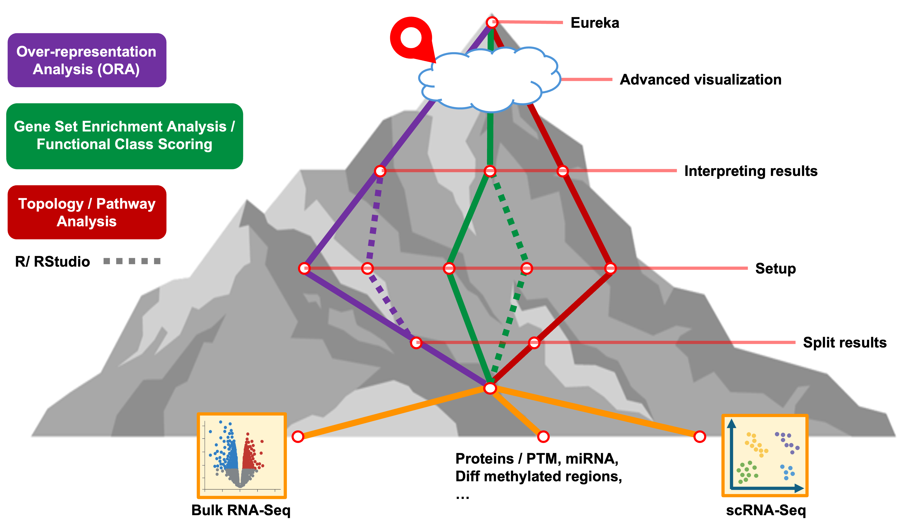

<style type="text/css">

body, td {
   font-size: 16px;
}
code.r{
  font-size: 12px;
}
pre {
  font-size: 12px
}

</style>

```{r klippy, echo=FALSE, include=TRUE}
klippy::klippy(lang = c("r", "markdown", "bash"), position = c("top", "right"))
```

```{r, 'chunk_options', include=FALSE}
source("../bin/chunk-options.R")
knitr_fig_path("02-")
```



# Objectives

- 1 Meta-analysis Venn
- 2 Meta-analysis Upset
- 3 Barplot
- 4 Heatmap
- 5 KEGG highlighting?

...

# Summary

- 1
- 2
- 3

<br/>
<br/>
<hr/>
| [Previous lesson](06-WebGestaltRGSEA.html) | [Top of this lesson](#top) | [Next lesson](08-analysis-summary.html) |
| :--- | :----: | ---: |