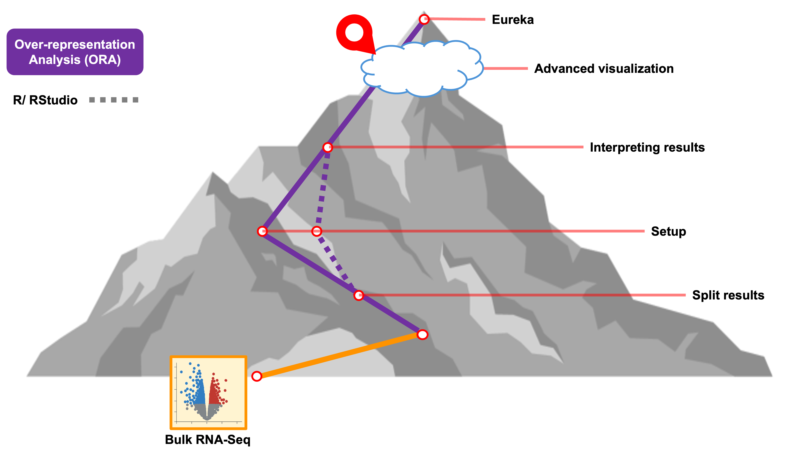

<style type="text/css">

body, td {
   font-size: 16px;
}
code.r{
  font-size: 12px;
}
pre {
  font-size: 12px
}

</style>

```{r klippy, echo=FALSE, include=TRUE}
klippy::klippy(lang = c("r", "markdown", "bash"), position = c("top", "right"))
```

```{r, 'chunk_options', include=FALSE}
source("../bin/chunk-options.R")
knitr_fig_path("02-")
```



# Objectives

- Compare between sets of genes from ORA results
- Summarize expression differences for genes associated with a GO term of interest
- 

# Getting started

In this section, we'll generate additional visualizations - beyond what was generated by `WebGestaltR` - for our bulk RNA-seq ORA results. 

First, we'll load a library called `ComplexHeatmap` that we will be using for some of our visualizations in addition to the plotting that is available to use from `ggplot2` after previously loading the `tidyverse`.    

<!-- # library(VennDiagram) # missing library -->
```{r libraries}
# =========================================================================
# Advanced Visualizations I
# =========================================================================

# -------------------------------------------------------------------------
# Load additional libraries
library(tidyverse)
library(ComplexHeatmap)

```

```{r getwd, eval = FALSE}
# -------------------------------------------------------------------------
# Check current working directory
getwd()
```

# Generate visualizations for ORA results

To create visualizations for the ORA enrichments, we'll start by reading in the table that `WebGestaltR` output to file. 

```{r viz_read_ora}
# -------------------------------------------------------------------------
# Read in results
enriched_ora = read_delim('results/Project_deficient_vs_control_ORA_GO_BP/enrichment_results_deficient_vs_control_ORA_GO_BP.txt')
head(enriched_ora)
```
 In addition to the enrichment statistics, the table also includes a column called `userId` that includes the names of the genes that were both annotated for that GO term and part of the list of DE genes of interest that we provided for the enrichment. Let's pull out those values and transform them into a structure that is more R friendly. 

```{r subset_genes}
# -------------------------------------------------------------------------
# create empty list
go_geneSets <- list()

# -------------------------------------------------------------------------
# create lists of overlapping DE genes for each GO term
for(i in 1:length(enriched_ora$description)){
  go_name <- enriched_ora$description[i] # descriptive GO term names
  go_genes <- str_split_1(enriched_ora$userId[i], ";") # list of gene symbols from table entry
  go_geneSets[[go_name]] <- c(go_genes)
}

# -------------------------------------------------------------------------
# check the named lists
head(go_geneSets)
```

Now we have a list of the names of each GO term and then nested lists of the DE genes for each term. 

## Investigate gene overlaps

Earlier, we saw that based on the DAG of GO terms in our initial enrichment using the web-browser version of `WebGestalt` that the "neuron death" and "intrinsic apoptotic signaling pathway" terms. Let's check what DE genes are shared between those two terms:

```{r genes_overlaps}
# -------------------------------------------------------------------------
# check what genes are shared between the two terms
intersect(go_geneSets$`neuron death`, go_geneSets$`intrinsic apoptotic signaling pathway`)
```

We see that five genes are shared between the two terms out of the total set that are both annotated for each GO term and provided as DE genes of interest for the enrichment. 


<!--If package installed, add plotting for Venn -->
```{r genes_venn, eval=FALSE, echo=FALSE}
# -------------------------------------------------------------------------
# XX
```

While comparing genes between two sets of genes is fairly straightforward, if we wanted to understand how many genes are shared versus unique across all the significant terms in our ORA enrichmemt results using `WebGestaltR` this approach would be quite tedious. 

Instead we can opt for visualizations that use a broader type of set analysis. One option is something called an [UpSet plot](https://upset.app/). Unlike  that doesn't limit the number of sets that can be compared, unlike more traditional approaches like Venn diagrams. With the [Complex Heatmap package](https://jokergoo.github.io/ComplexHeatmap-reference/book/upset-plot.html), we can use the named list as our starting point. <!-- add details about input matrix --> 

```{r genes_upset_matrix, eval=TRUE}
# -------------------------------------------------------------------------
# First make the combination matrix from our list of genes for each GO term
m = make_comb_mat(go_geneSets)
m
```

In the combination matrix results, we can see the total number of sets being compared and a representation of the overlaps. This is useful not as nice as something more visual. 

Using the combination matrix, we can create a simple UpSet plot comparing the DE genes annotated for each GO term:

```{r genes_upset, eval=TRUE}
# -------------------------------------------------------------------------
# Make simple UpSet plot
UpSet(m)
```

Let's breakdown the parts of this plot:    

- On the left are the descriptive names of the GO terms, that we provided.     
- On the right are bar plots summarizing the total set size, which in this case is the total number of genes that were DE in our data for each term.    
- The center area shows the set comparison. The single dots on the right represents the values that are included in that term but not the other terms being compared. The dots connected by lines show the shared values between the indicated terms. In this case, we see sets of 2-3 terms that have at least one shared value.      
- The top bar plots show the counts for each set comparison. The default mode is 'distinct' so the height of the bar corresponds to the number of genes that are only part of that set intersection.     


Now that we understand the parts of the plot, let's make some adjustments to make the plot easier to read. You can use the same colors or [pick your own from ggplots named options](https://sape.inf.usi.ch/quick-reference/ggplot2/colour):

```{r genes_upset_2, eval=TRUE}
# -------------------------------------------------------------------------
# Make simple UpSet plot
upsetGO <- UpSet(m, comb_order = rev(order(comb_size(m))), lwd = 3,
                 comb_col = c("black", "blue", "gold3")[comb_degree(m)],
                 left_annotation = upset_left_annotation(m, add_numbers = TRUE))
upsetGO
```

Now we have the GO term dots connected with a thicker line to indicate the combination and a color designated for each degree of intersection (black = unique, blue = shared by two terms, gold = shared by three terms). We also have the intersections sorted by size and the set size bar moved to the left with the values added. 

> Question:
> What term has the fewest unique associated genes? Which term has the most?
>

*Note* - This is just a fraction of all the possible customizations that are available [via the ComplexHeatmap package](https://jokergoo.github.io/ComplexHeatmap-reference/book/upset-plot.html#make-the-combination-matrix) but for the sake of time, we'll limit our plot adjustments to this, at least for now. 

Let's output our customized UpSet plot to file:

```{r genes_upset_output, eval=TRUE}
# -------------------------------------------------------------------------
# Output UpSet plot to file
png(file = "./results/figures/deficient_vs_control_GO-BP_UpSetPlot.png", width = 1000, height = 400)
  draw(upsetGO) # draw the plot
dev.off() # Close the graphics device
```
<!-- Note that the labels exceed the size of the margins, not sure how best to fix this -->

We only have a single comparison between deficient and control conditions for our bulk results, but for experiments that have more than one comparison we can also use these approaches to compare what GO terms are shared/unique between different DE comparisons instead of comparing what genes are unique/shared. 

<br>

# Summarize gene expression for ORA results

Since ORA does not account for the fold-change size or direction, we can combine our enrichment results with our DE statistics to summarize the gene expression for terms of interest.

```{r viz_read_exp}
# -------------------------------------------------------------------------
# If not already loaded, read in diffex results
rsd_diffex = read_csv('inputs/bulk_de_results/de_deficient_vs_control_annotated.csv')

# -------------------------------------------------------------------------
# Take another look at our DE table
head(rsd_diffex)
```

To visualize the expression for genes annotated as part of `small molecule metabolism`, which might be interesting since the treatment was a difference in diet, we'll need to subset our results to the DE genes of interest for that term.

```{r genes_subset}
# -------------------------------------------------------------------------
# Subset RSD table to genes that match those in our list for the GO term of interest

rsd_smallmolecule <- rsd_diffex %>% filter(symbol %in% go_geneSets$`regulation of small molecule metabolic process`)
head(rsd_smallmolecule)
```

Let's start by using the subsetted table to create a simple barplot of the fold-change values for each gene:

```{r genes_barplot}
# -------------------------------------------------------------------------
# Simple barplot of fold-changes
ggplot(rsd_smallmolecule, aes(x = symbol, y = log2FoldChange)) +
  geom_col()
```

This is helpful but could be improved with some formatting adjustments and labels. Let's do that next:

```{r genes_barplot2}
# -------------------------------------------------------------------------
# Create a more sophisticated barplot of fold-changes

rsd_smallmolecule_barplot <- ggplot(rsd_smallmolecule, aes(x = reorder(symbol, -log2FoldChange), y = log2FoldChange, fill = log2FoldChange > 0)) +
  geom_col() +
  labs(
    title = "Fold-Change of Categories",
    x = "Gene symbol",
    y = "log2 fold-change"
  ) +
  scale_fill_manual(values = c("TRUE" = "darkred", "FALSE" = "darkblue"),
                    labels = c("Down-regulated", "Up-regulated"),
                    name = "Regulation") +
  theme_minimal() 

rsd_smallmolecule_barplot
```
Now we can see we see that the genes order by their fold-change values from our DE results and colored by their status (Up- vs Down- regulated). 
<br>

>
> Does anything jump out about these results? Are you surprised that some genes are upregulated but other genes in the same term are down regulated?
>

Let's also write this out to file:
```{r output_barplot}
# -------------------------------------------------------------------------
# Output the barplot to file
png(file = "./results/figures/deficient_vs_control_fold-changes_regulation-of-small-molecule-metabolic-process.png", width = 800, height = 500, res = 100)
  rsd_smallmolecule_barplot
dev.off() # Remember to close the graphics device
```

<!-- wait to use heatmaps until get to single-cell data -->

# Clean up session 

To ensure that we don't leave objects in our environment that will slow down our log-in and session load time tomorrow morning, let's clear our environment and re-start our R session now. 

1. To power down the session, click the orange power button in the upper right corner of the RStudio window. Note: There is no confirmation dialogue, the session will simply end.
2. Click the "Start New Session" button to restart the RStudio session.
3. Re-load the libraries:

```{r, load_rds, eval = FALSE}
# -------------------------------------------------------------------------
# Load primary libraries
library(WebGestaltR)
library(tidyverse)

setwd("~/IFUN_R/")
```
<br/>
<br/>
...

# Summary

- Set comparisons can be useful for understanding our enrichment results
- UpSet plots are an easy way to compare and visualize the common and unique values for a large number of sets.
- We can use more familiar visualization approaches like barplots to see if there are any interest patterns in our expression data for genes associated with functional terms of interest

<br/>
<br/>
<hr/>
| [Previous lesson](03-WebGestaltRORA.html) | [Top of this lesson](#top) | [Next lesson](05-fcs-gsea-overview.html) |
| :--- | :----: | ---: |