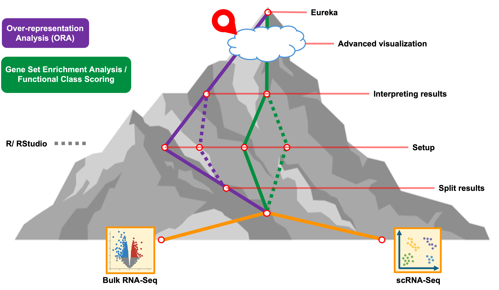

<style type="text/css">

body, td {
   font-size: 16px;
}
code.r{
  font-size: 12px;
}
pre {
  font-size: 12px
}

</style>

```{r klippy, echo=FALSE, include=TRUE}
klippy::klippy(lang = c("r", "markdown", "bash"), position = c("top", "right"))
```

```{r, 'chunk_options', include=FALSE}
source("../bin/chunk-options.R")
knitr_fig_path("02-")
```



# Objectives

- Meta-analysis Upset
- Heatmap
- KEGG highlighting?

<!-- # library(VennDiagram) # missing library -->
```{r getwd, eval = FALSE}
# =========================================================================
# Advanced Visualizations II
# =========================================================================

# -------------------------------------------------------------------------
# Load additional libraries
library(ComplexHeatmap)
library() # VennDiagram option

# -------------------------------------------------------------------------
# Check current working directory
getwd()
```

We should have the GSEA results in our session but we can read in the results from the table output to file by `WebGestaltR` for the results from the Day21 vs Day7 and Day7 vs Day 0 pericyte single-cell RNA-seq comparisons. 

```{r viz_read_ora}
# -------------------------------------------------------------------------
# Read in results for the enrichment for each set of timpoint comparisons
isc_d21_v_d7_gsea_result = read_delim('results/Project_D21_v_D7_GSEA_KEGG/enrichment_results_D21_v_D7_GSEA_KEGG.txt')

isc_d7_v_d0_gsea_result = read_delim('results/Project_D7_v_D0_GSEA_KEGG//enrichment_results_D7_v_D0_GSEA_KEGG.txt')

head(isc_d21_v_d7_gsea_result); head(isc_d7_v_d0_gsea_result)
```

Instead of comparing gene sets between enriched terms from a single set of results, we can instead compare what enrichments are found from two different comparisons. Since the KEGG ids and descriptions are organized into columns of the results tables we don't need to do as much processing to compare between the enriched pathways. 

```{r path_overlaps}
# -------------------------------------------------------------------------
KEGG_results_shared <- full_join(isc_d21_v_d7_gsea_result, isc_d7_v_d0_gsea_result, 
                                  by = c("geneSet", "description"),
                                  suffix = c(".D21", ".D7"))

head(KEGG_results_shared)


```


However, since the number of sets in one of our comparisons exceeds the limit allowed for `ComplexHeatmap`'s version of an upSet plot (which is `31`), we'll use a Venn Diagram to visualize the comparison.


```{r path_Venn, eval=TRUE}
# -------------------------------------------------------------------------
# Make simple UpSet plot
UpSet(m)
```


# Summary

- 1
- 2
- 3

<br/>
<br/>
<hr/>
| [Previous lesson](04-gene-set-references.html) | [Top of this lesson](#top) | [Next lesson](08-analysis-summary.html) |
| :--- | :----: | ---: |