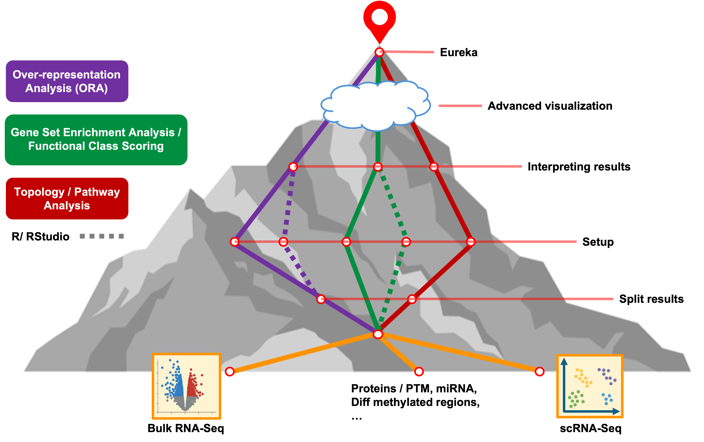

<style type="text/css">

body, td {
   font-size: 16px;
}
code.r{
  font-size: 12px;
}
pre {
  font-size: 12px
}

</style>

```{r klippy, echo=FALSE, include=TRUE}
klippy::klippy(lang = c("r", "markdown", "bash"), position = c("top", "right"))
```

```{r, 'chunk_options', include=FALSE}
source("../bin/chunk-options.R")
knitr_fig_path("02-")
```



# Summary

- 1
- 2
- 3

<br>

# Resources

Alternative tools and tutorials:

- GSEA with ClusterProfiler: https://learn.gencore.bio.nyu.edu/rna-seq-analysis/gene-set-enrichment-analysis/
- ESCAPE for single-cell enrichments: https://www.borch.dev/uploads/screpertoire/articles/running_escape
- Single Cell Best Practices book chapter on Funtional Enrichments: https://www.sc-best-practices.org/conditions/gsea_pathway.html#
- Broad GSEA: https://www.gsea-msigdb.org/gsea/doc/GSEAUserGuideFrame.html
- Enrichment visualization with `enrichplot`: https://yulab-smu.top/biomedical-knowledge-mining-book/enrichplot.html

<br>


<br/>
<br/>
<hr/>
| [Previous lesson](07B-advanced-visualizations.html) | [Top of this lesson](#top) | [Next lesson](workshop-wrap-up.html) |
| :--- | :----: | ---: |