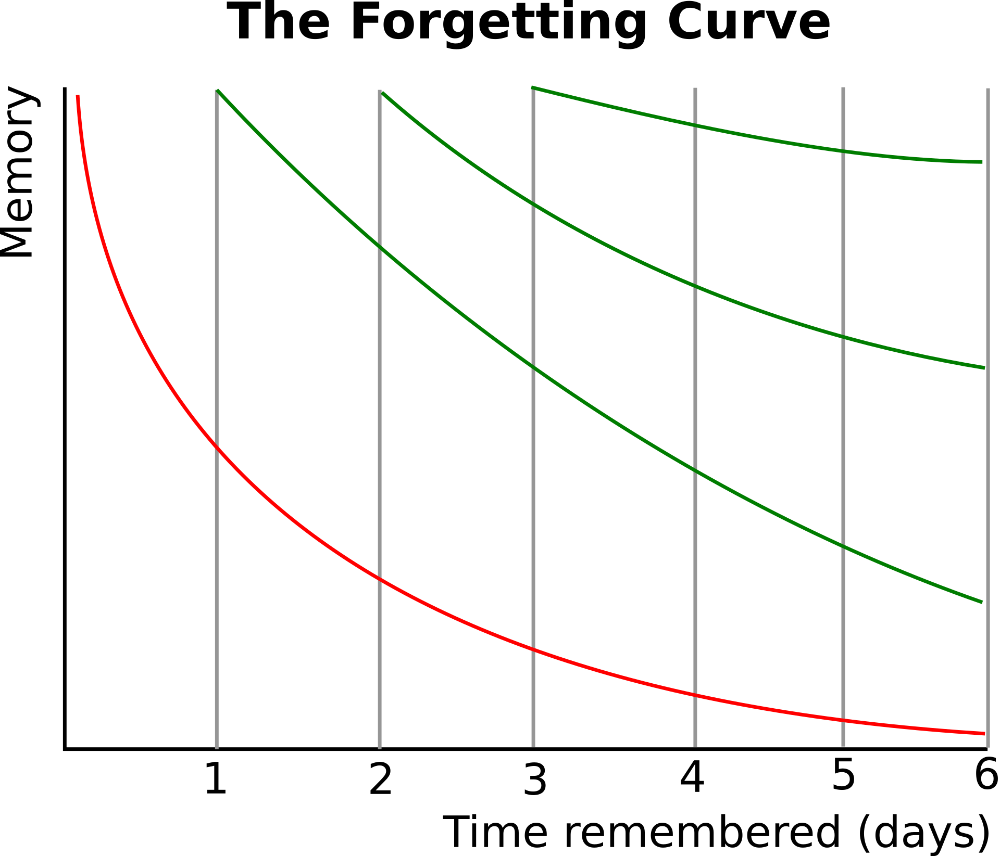

<style type="text/css">

body, td {
   font-size: 16px;
}
code.r{
  font-size: 12px;
}
pre {
  font-size: 12px
}

</style>

```{r klippy, echo=FALSE, include=TRUE}
klippy::klippy(lang = c("r", "markdown", "bash"), position = c("top", "right"))
```

```{r, 'chunk_options', include=FALSE}
source("../bin/chunk-options.R")
```

The [Ebbinghaus forgetting curve](https://en.wikipedia.org/wiki/Forgetting_curve) 
reminds us that all memories fade with time. But it also suggests you can 
ameliorate the decay with practice and repeated application.



Here's a few problems for individual practice.


## Day 1

### Exercise 1.1:

### Exercise 1.2:

## Day 2

### Exercise 2.1:

### Exercise 2.2:

<br/>
<br/>
<hr/>
| [Previous lesson](08-analysis-summary.html) | [Top of this lesson](#top) | [Next lesson](workshop-wrap-up.html) |
| :--- | :----: | ---: |