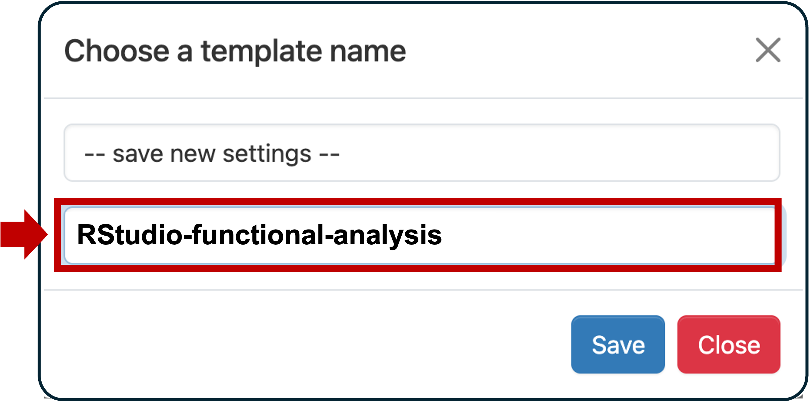
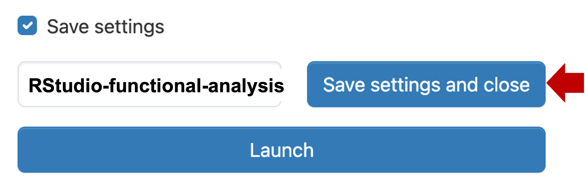
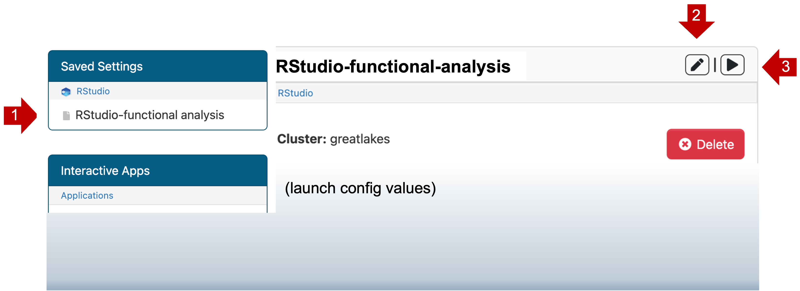

<style type="text/css">
body, td {
   font-size: 18px;
}
code.r{
  font-size: 12px;
}
pre {
  font-size: 12px
}
</style>

```{r klippy, echo=FALSE, include=TRUE}
klippy::klippy(lang = c("r", "markdown", "bash"), position = c("top", "right"))
```

```{r, include = FALSE}
library(stringr)
source("../bin/chunk-options.R")
source("../bin/set_values.R")
```


## Objectives
You can run RStudio and many bioinformatics R libraries using 
University of Michigan's **Great Lakes** High Performance Cluster (HPC). By the 
end of this guide you will be able to:

- Use **Great Lakes** and **Open OnDemand** to start a RStudio session with 
  pre-installed libraries for functional analysis.
- Copy/paste content from your workstation to RStudio and back.
- Open a new browser window within an Open OnDemand session.
- Transfer files between Great Lakes and your workstation

---

## Background
You can run many bioinformatic analyses locally on your workstation. However, 
running these on Great Lakes is a nice approach because:

- Some analyses requires a LOT of memory (RAM). It's easy to ask 
  for more memory on Great Lakes and Great Lakes nodes have more memory 
  available than a typical laptop/workstation.
- Often, much of the software is pre-installed. Installing bioinformatics 
  software is typically nuanced and often unpleasantly complex - so having it 
  ready is a _big win_. (Thanks to the ARC team for getting all this installed!)

That said, using Great Lakes is different than using your laptop/workstation.
A few key ideas:

-  Great Lakes is provided by [UM Advanced Research Computing](https://its.umich.edu/advanced-research-computing){target="_blank"}. It is only available to folks affiliated with UM.
- Great Lakes uses **Open OnDemand** to reserve a part of the cluster to run 
  your analysis in RStudio.  
-  Great Lakes requires some setup.
-  Great Lakes is a recharge service, BUT it is heavily subsidized and extremely 
   affordable for most researchers. (Many researchers who are doing a low to 
   moderate amount of data analysis may not have to pay anything.)

---

### How to get help

-   If you have problems/questions, please don't hesitate to email us
    at:
    [bioinformatics-workshops@umich.edu](mailto:bioinformatics-workshops@umich.edu)

-   When emailing it will speed things along if you could include:
    -   Whether you are using Windows or Mac (and optionally which
        version of the OS you are using).
    - What browser you are using.
    - Whether you are on campus or using the VPN.
    - The specific text of any error messages, if applicable.

---

### What you need

1. You need a UM core-imaged workstation and a web browser.

2. You need to be on UM campus or connected to the [UM VPN](https://its.umich.edu/enterprise/wifi-networks/vpn/getting-started){target="_blank"} 
   or [Michigan Medicine VPN](https://hits.medicine.umich.edu/accounts-access/wifi-networks/vpn-remote-network-access){target="_blank"} using 
   Cisco Secure Client. (Setting this up will also require Duo 2-factor authentication.)

3. You need a user account on Great Lakes. The first time, you need to request 
   this from ARC; it can take 1-2 days to get set up:
   - see [Getting Started with the Great Lakes Cluster](https://its.umich.edu/advanced-research-computing/high-performance-computing/great-lakes/getting-started){target="_blank"} to get setup.
   - also, to save money, request the [UM Research Compute Package (UMRCP)](https://its.umich.edu/advanced-research-computing/research-computing-package){target="_blank"} to offset costs with subsidy from UM.

4. You will need enough storage space. How much depends on the experimental 
design and what analyses you want to do. Functional analyses don't take up much 
disk space, so **2GB** is plenty for the workshop activities.

As a new user, you can execute this tutorial from your home dir. As 
your experiments and analyses grow, you can check your available space from the 
command line (`home-quota`) and request more storage from ARC as necessary. 

5. You will need data. Below, we'll show you how to download the input data used
   in the workshop, but you can adapt that to use your own data.

---

## Using Open OnDemand


Once you've got everything you need from above, you're going to use **Open OnDemand** 
(OOD) to launch a RStudio session.

- OOD connects you to the Great Lakes cluster through your web browser.
- OOD works with the **SLURM workload manager** to reserve and configure a 
**compute node** that will run RStudio. 

1. If off-campus, connect to the VPN using Cisco Secure Client.

2. In your browser, go to Great Lakes Open On Demand:   
   [greatlakes.arc-ts.umich.edu](https://greatlakes.arc-ts.umich.edu){target="_blank"} and 
   login with your uniqname and password. 

3. In the menu at the top of the screen, click **Interactive Apps** and select 
   **RStudio**. 

4. The previous step will display a _launch configuration page_ with several fields, e.g.
       
    ...
    
    <a id="launch_config_values"></a>
    
    Enter launch configuration values below in the corresponding fields:
  
```{r, child='images/great-lakes-ood/IFUN/launch-config.Rmd'}
```

5. After you've entered the values above, at the bottom of this page click **Launch**. 
   (Conveniently, the values you entered above will now be your default for 
   launching an RStudio session.) The screen will update to show Great Lakes is 
   preparing your session. 
   {width=50%}

6. When the session is ready (usually a few seconds later), the screen will update:
   {width=50%}
    - Drag the Compression slider all the way to the right
    - Drag Image Quality slider all the way to the right
    - Click **Launch RStudio**

7. This will open a new browser tab that contains your RStudio session:


8. You may see a prompt asking permission to use the clipboard. Click **Allow**.
{width=25%}

If you need to set or reset the clipboard settings, you can click on the 
*site information icon* left of the browser's URL:

| Edge Browser | Chrome Browser|
|:-:|:-:|
|  |  |


---

## Using RStudio


On Great Lakes, you launch a RStudio session on a SLURM **compute node**. 

- The compute node can run RStudio, a browser, or other programs/tools. 
- The browser connects to the the compute node through a utility called **NoVNC**. 
- Accessing the compute node through the browser is a convenient way to use a GUI
like RStudio, but it means that some functionality (e.g. copy-paste) works 
slightly differently.

### Shortcuts / copy-paste

- In the Rstudio window, you can Zoom in and out using _control +_ and _control -_. 
- Running RStudio in the browser inside the Great Lakes HPC complicates copying 
  and pasting from your computer to/from the remote session.
  - Copy-paste functionality doesn't always work perfectly. Sometimes you may 
    need to copy twice to get the content into the buffer. So check your work.
  - Within the RStudio window you can right-click to get a copy or paste context menu.
  - Keyboard shortcuts are _control C_ and _control V_. This is familliar to PC 
    users *but will take some getting used to for Mac-users*.
  - Copy and paste _mostly_ work as expected using Chrome or Edge browsers. 
    Other browsers (e.g. Safari) require extra steps:
    - Open the control panel (left side) 
    {width=25%}
    - Select the clipboard icon.
    {width=25%}
    - Copy text into the clipboard area; within that area, use the native 
      keyboard shortcuts, i.e. control-C on PC or command-C on Mac). Close the
      control panel.
      
    - Right-click (or _control V_) to paste the contents into the console.
    {width=50%}

- If the copy-paste pattern is too flaky or clumsy for your tastes, you can
  upgrade your experience by switching from using Open OnDemand in the browser
  to a [VNC viewer](https://www.realvnc.com/en/connect/download/viewer/){target="_blank"}. 
  (Macs have a built in VNC viewer, but that viewer doesn't support copy/paste 
  with a Unix system.) Details on how to set this up are outside the scope
  of this guide, but [reach out](#how-to-get-help) and we can help.

---

### Open a browser

- FYI, you can launch the Firefox browser by clicking on Applications (top left) | 
  Web Browser. This will open another application tab (along the top).
  {width=50%}
- If you want to do any substantial copy/paste, we recommend you use this browser 
  window because it's more reliable to copy/paste within the session than from
  your local computer.

---

### Exiting

- The RStudio session will last for 4 hours (or however long you specified in 
  launch config above).
- If you close the browser window, you can click **Launch RStudio** again from
  the [Open OnDemand session page](https://greatlakes.arc-ts.umich.edu/pun/sys/dashboard/batch_connect/sessions){target="_blank"} 
- You can end the session several ways. _Make sure your scripts and data are saved because these actions do not prompt to save or confirm; and once the session is closed it is gone for good._ <br/>
Any of the following actions will end your session:
  - In RStudio menu at the top, click File | Quit
  - In RStudio, click Session | Quit Session
  - In RStudio, close the RStudio window (top right X)
  {width=25%}
  - In [Open OnDemand session page](https://greatlakes.arc-ts.umich.edu/pun/sys/dashboard/batch_connect/sessions){target="_blank"}, click **Delete**.
  {width=50%}

---  
  
## Download workshop inputs

1. The inputs used in the workshop can be downloaded to this session. In the 
   RStudio window, click on the  **Terminal** tab. The tab will be blank with a 
   prompt that looks something like this: `[YOUR_UNIQNAME@glXXXX ~]$ `

2. Paste the following block into the Terminal prompt: and hit _Enter/Return_. 
   This will take a minute or two to download and unpack the inputs.

```{r build_download_script, echo=FALSE}
# This injects the AWS bucket and path R variables into the template
# You could do this with inline R but then you would have to evaluate the chunk
# and we don't really want that.
file_content <- readLines("download_script_template.txt")
file_string = paste(file_content, collapse = "\n")
writeLines(stringr::str_glue(file_string), "download_script.txt") 
```

    ```{bash download_script, file='download_script.txt', eval=FALSE}
    ```

    You can use `ls` or `tree` to show the contents of the inputs dir:

```{r, child='images/great-lakes-ood/IFUN/inputs-dir-contents.Rmd'}
```


3. Now you can review the [workshop lessons](index.html){target="_blank"}
   and execute analyses on these input data. 

---

## Transferring files


There are several ways to move files to or from Great Lakes.

  1. For small transfers, you can use [Open OnDemand file browser](#open-ondemand-file-browser).
  2. For large transfers, we recommend [Globus](#globus)
  3. You can also use [command line tools](#command-line-tools)  

- Note that to transfer a file to/from Great Lakes, you will need to be on the 
  campus network or on the VPN.

### Open OnDemand file browser

Open OnDemand (OOD) lets you browse your files and move small files 
(e.g. scripts or plots) between your workstation and Great Lakes using your web 
browser.

1.1 _In your workstation's  browser_, open the [OOD Dashboard](https://greatlakes.arc-ts.umich.edu/){target="_blank"}. 
    Along the top menu, click on **Files**. (Note that if you shrink the screen very small, the menu items will be hidden in a "hamburger".)
    In the dropdown menu, click **Home Directory**.
   
  
1.2 OOD will display the contents of your home directory. You can click on a 
    directory to see its contents.
    
1.3 To view a plot graphic, you can click on the hamburger and then select **View**.
    This will open the plot in a new browser tab.
    
1.4 You can download one or more files by selecting their checkboxes and 
    clicking the **Download** button. (Note: if you select a directory and click
    **Download**, OOD will download the contents as a single zipped file.)
    

### Globus

To process RNA-Seq FASTQs or run CellRanger or Seurat on your own files, we 
recommend transferring the FASTQ files or cellranger outputs to Great Lakes using 
**Globus**. 

- Globus is a fast, secure, and fault tolerant way to move files of any size.
- Globus is much better than OOD for transferring larger files like FASTQ files,
  Cell Ranger outputs, or saved Seurat data objects.
- Details on how to set up and use Globus are outside the scope of this guide, 
  but we recommend these links:
  
  - [ARC Globus page](https://documentation.its.umich.edu/node/5019){target="_blank"}
  - [ARC Video on using Globus](https://www.mivideo.it.umich.edu/media/t/1_uk9nmxsw/181860561?st=2980){target="_blank"}
  - [Globus tutorial from Reproducible Computing workshop](https://umich-brcf-bioinf.github.io/workshop-reproducible-computing/main/html/Module_transferring_data_globus.html){target="_blank"}

### Command line tools

For larger files/directories, we strongly recommend you use Globus. That said, 
if you are more comfortable with command line tools, you can transfer files 
using the **secure copy** command [scp](https://man7.org/linux/man-pages/man1/scp.1.html){target="_blank"}. 
`scp` is a lot like `cp` but it allows you to copy files across a network.

To transfer from your workstation to Great Lakes:

3.1 From you workstation terminal or command window, `cd` into the directory that 
    contains your data. 
3.2 Adjust the `scp` command below to match the correct source directory and 
    uniqname and hit _Enter/Return_ to execute.

  ```
  # Copy the SOURCE_DIR dir contents from your workstation to Great Lakes home dir
  # -r copies recursively 
  # -p preserves the file modification times
  scp -pr SOURCE_DIR YOUR_UNIQNAME@greatlakes-xfer.arc-ts.umich.edu:
  ```

3.3 The first time you run this command, you may see a prompt like the following; type **yes** and hit _Enter/Return_ to continue.

    The authenticity of host '...' can't be established.
    ECDSA key fingerprint is SHA256:....
    Are you sure you want to continue connecting (yes/no/[fingerprint])? yes

  The command will print a warning (e.g. _Warning: Permanently added ‘SERVER_ADDRESS’ to the list of known hosts_). 
  This is fine.

3.4 When prompted, type your UM password followed by Enter/Return.

  - **Note that the server will not echo any characters when you are typing your password;*** this is ok.
  - Note that the password is case sensitive. 


3.5 You can also transfer files from Great Lakes to your workstation. From your 
    workstation terminal or command window, adjust the `scp` command 
    below to match the correct source file and uniqname and hit _Enter/Return_ 
    to execute.

  ```
  # Copy the SOURCE_FILE from Great Lakes to your current workstation dir
  scp YOUR_UNIQNAME@greatlakes-xfer.arc-ts.umich.edu:PATH/TO/SOURCE_FILE . 
  ```

3.6 When prompted, type your UM password followed by Enter/Return.

  - **Note that the server will not echo any characters when you are typing your password;*** this is ok.
  - Note that the password is case sensitive. 

---

### Exiting

- The Basic Desktop session will last for 1 hour (or however long you specified in 
  launch config above).
- If you close the browser window, you can reconnect by clicking **Launch Basic Desktop** again from
  the [Open OnDemand session page](https://greatlakes.arc-ts.umich.edu/pun/sys/dashboard/batch_connect/sessions){target="_blank"} 
- Any of the following actions will end your session:
  - Click on the **Applications** menu (top left) and select **Log Out**.
  - Click on your name (top right) and select **Log Out**.
  - In [Open OnDemand session page](https://greatlakes.arc-ts.umich.edu/pun/sys/dashboard/batch_connect/sessions){target="_blank"}, click **Delete**.
  {width=50%}

---  


## Launch templates

Many config values have to be specified when launching an interactive job from 
Open OnDemand (OOD). Different jobs require different configs, but quite often a *type 
of job* (e.g. functional analysis, bulk RNA-Seq, scRNA-Seq, Cell Ranger, etc.) 
will use the same values each time. OOD allows you to save **launch templates** 
to simplify starting common jobs.

### Functional analysis template

1. If off-campus, connect to the VPN using Cisco Secure Client.

2. In your browser, go to Great Lakes Open On Demand:   
   [greatlakes.arc-ts.umich.edu](https://greatlakes.arc-ts.umich.edu){target="_blank"} and 
   login with your uniqname and password. 

3. In the menu at the top of the screen, click **Interactive Apps** and select 
   **RStudio**. 

4. Enter launch configuration values below in the corresponding fields:

```{r, child='images/great-lakes-ood/IFUN/launch-config.Rmd'}
```
  
5. Scroll to the bottom and click the checkbox **Save settings**. This will 
   show a dialog that let's you name this template. Enter **RStudio-Functional-Analysis** and 
   click **Save**.
  {width=50%}
6. Now click **Save settings and close**.<br/>
   {width=50%}

7. Saved templates are listed at the top of [My Interactive Sessions](https://greatlakes.arc-ts.umich.edu/pun/sys/dashboard/batch_connect/sessions){target="_blank"}

  - You can review the launch config values by clicking on the name **RStudio-Functional-Analysis** (1).
  - You can change the launch config values by clicking **edit** (2).
  - You can launch a new job with this config by clicking launch (3).

---


## Summary


- You can run **RStudio** and related bioinformatics tools using University of 
  Michigan's **Great Lakes** High Performance Cluster (HPC).
- Running on Great Lakes is a nice option because the libraries and software are
  pre-installed and you can run RStudio with as much memory as you need.  
- **Open OnDemand** (OOD) connects you to the Great Lakes cluster through your 
  web browser.
- Using Great Lakes requires some set up.
- Running RStudio on Great Lakes is a bit different than running it on your 
  workstation. Depending on your workstation and browser, copy/paste on RStudio can require 
  different keyboard shortcuts or different steps. 
- OOD, Globus, and command line tools are several ways to transfer files between 
  Great Lakes and your workstation.
- OOD **Launch templates** can save launch configs and simplify how you start 
  common jobs.  

---

## References/Links

- [UM CoderSpaces "office hours"](https://datascience.isr.umich.edu/events/coderspaces/){target="_blank"} and UM CoderSpaces Slack workspace. _(See "Useful Resources" section in CoderSpaces page for instructions on how to join and access the CoderSpaces Slack workspace.)_
- [Advanced Research Computing](https://its.umich.edu/advanced-research-computing){target="_blank"}
  - [Research Computing Package](https://its.umich.edu/advanced-research-computing/research-computing-package){target="_blank"}
  - Upcoming [UM Advanced Research Computing workshops](https://ttc.iss.lsa.umich.edu/ttc/sessions/tag/hpc/){target="_blank"}
- [Great Lakes HPC](https://its.umich.edu/advanced-research-computing/high-performance-computing/great-lakes/getting-started){target="_blank"}
  - [Great Lakes User Guide](https://documentation.its.umich.edu./node/4975)
  - [Great Lakes Concepts](https://docs.google.com/document/d/1ew_LIFmQnEu95B5mkGsKeMGxKbvbHTbEAMIpRBgJp7c/edit?tab=t.0){target="_blank"} and  [SLURM cheatsheet](https://docs.google.com/document/d/e/2PACX-1vSGaQfRZswv3kQBGzJZRIimOqtDmUOuQBrCdMwiptIK6g9FOT5OW1t1H40eByiTbEcxZ3udfOMQGvMr/pub){target="_blank"}
  - Videos on [getting started with Great Lakes](https://www.mivideo.it.umich.edu/playlist/dedicated/1_rmm5rnp1/){target="_blank"}
  - [HPC Software Catalog](https://umich-arc.github.io/arc-software-catalog/){target="_blank"}
  - [Using Software Modules](https://docs.support.arc.umich.edu/modules/)
- Globus 
  - [ARC Globus page](https://documentation.its.umich.edu/node/5019){target="_blank"}
  - [ARC Video on using Globus](https://www.mivideo.it.umich.edu/media/t/1_uk9nmxsw/181860561?st=2980){target="_blank"}
  - [Globus tutorial from Reproducible Computing workshop](https://umich-brcf-bioinf.github.io/workshop-reproducible-computing/main/html/Module_transferring_data_globus.html){target="_blank"}
