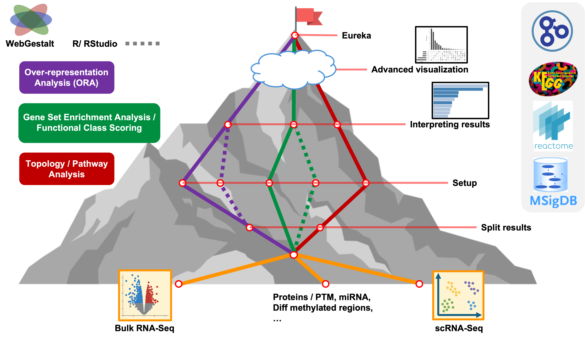

<style type="text/css">

body, td {
   font-size: 18px;
}
code.r{
  font-size: 12px;
}
pre {
  font-size: 12px
}

</style>

```{r, include = FALSE}
source("../bin/set_values.R")
```

```{r klippy, echo=FALSE, include=TRUE}
klippy::klippy(lang = c("r", "markdown", "bash"), position = c("top", "right"))
```



We hope you now have more familiarity with key concepts, tools, and techniques
that will enable more efficient, reproducible, and impactful computational research.

---

## Housekeeping

- We will email you a link to the final session recordings next week.

- This workshop website (aka "show notes") will be available.

- The content in the [UM Bioinformatics Core Workshop Slack channel](https://umbioinfcoreworkshops.slack.com){target="_blank"} 
  will be available for 90 days.

---

### Can I continue to use the RStudio environments we used in the workshop?
- The RStudio workshop compute environment will be available through `r workshop_vars$rstudio_server_enddate`.
  - _Please save all your R scripts now_ so that we can "right-size" the compute environment immediately following today's workshop session.
- You can download files from the workshop environment from your terminal/command line window as below.
  (You will need to substitute your actual workshop username and type workshop password when prompted.)
  ```
  mkdir workshop-intro-functional-analysis
  scp -r YOUR_USERNAME@`r workshop_vars$ssh_download_dns`:"IFUN*" workshop-intro-functional-analysis
  ```
### Where else could I use this software?
  - See [Advanced setup instructions](workshop_setup/setup_instructions_advanced.html){target="_blank"}
    for details on how to install RStudio and required packages on your own computer.
  - UMich users can run RStudio/WebGestaltR on the [UM Great Lakes HPC](webgestaltr-on-great-lakes.html){target="_blank"}.


---

## Thank you


## Thanks to/from the workshop team

```{r, child='helper-gallery.Rmd'}
```

Thank you for participating in our workshop. We welcome your questions and
feedback now and in the future.

Bioinformatics Workshop Team

[bioinformatics-workshops@umich.edu](mailto:bioinformatics-workshops@umich.edu) <br/>
[UM BRCF Bioinformatics Core](https://medresearch.umich.edu/office-research/about-office-research/biomedical-research-core-facilities/bioinformatics-core){target="_blank"}
